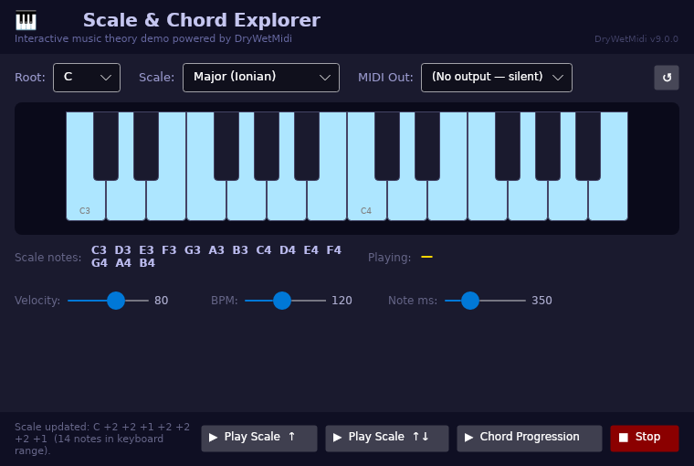
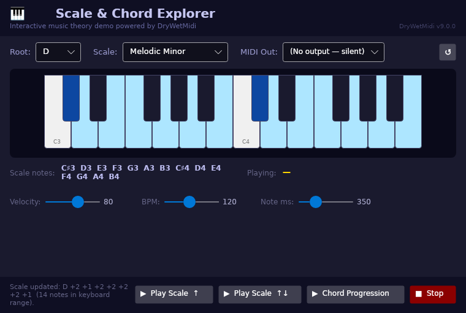

# Scale & Chord Explorer

A cross-platform GUI demo (Windows & macOS) for the [DryWetMidi](https://melanchall.github.io/drywetmidi) library, built with [Avalonia UI](https://avaloniaui.net/).

## Preview


| Overview | Controls updated |
|---|---|
|  |  |

## What it demonstrates

| Feature | DryWetMidi API used |
|---|---|
| Interactive piano keyboard (2 octaves, click to play a note) | `OutputEndpoint.SendEvent(NoteOnEvent / NoteOffEvent)` |
| Scale highlighting on the keyboard | `Scale`, `ScaleIntervals`, `scale.GetNotes()` |
| Scale ascending / ascending+descending playback | `PatternBuilder.Note()`, `pattern.GetPlayback()`, `TempoMap`, `Tempo` |
| I – IV – V – I chord progression playback | `PatternBuilder.SetNoteLength().Chord()` |
| Real-time key-lighting during playback | `Playback.NotesPlaybackStarted / NotesPlaybackFinished` events |
| Dynamic BPM, velocity, and note-length sliders | `Tempo.FromBeatsPerMinute()`, `SevenBitNumber` velocity |
| MIDI output device picker | `OutputEndpoint.GetAll()` |

## How to run

### Prerequisites

* [.NET 8 SDK](https://dotnet.microsoft.com/download/dotnet/8)
* A MIDI software synthesiser (optional but strongly recommended):
  * **Windows** — [VirtualMIDISynth](https://coolsoft.altervista.org/en/virtualmidisynth) or any General MIDI device
  * **macOS** — the built-in **DLS Synth** is exposed automatically; no extra install needed

### From the repository root

```bash
dotnet run --project Demos/ScaleChordExplorer/ScaleChordExplorer.csproj
```

Or open `Demos/ScaleChordExplorer/ScaleChordExplorer.csproj` directly in Visual Studio / Rider.

## User interface

```
┌─────────────────────────────────────────────────────────────────────┐
│  🎹 Scale & Chord Explorer          DryWetMidi vX.X.X               │
├─────────────────────────────────────────────────────────────────────┤
│  Root: [C ▼]  Scale: [Major (Ionian) ▼]  MIDI Out: [My Synth ▼] ↺  │
│                                                                     │
│  ┌──────────────────── 2-octave piano ─────────────────────────┐   │
│  │  White keys = light blue when in scale                      │   │
│  │  Black keys = dark blue when in scale                       │   │
│  │  Any key turns gold while sounding                          │   │
│  └─────────────────────────────────────────────────────────────┘   │
│                                                                     │
│  Scale notes: C3  D3  E3  F3  G3  A3  B3  C4 …     Playing: E3    │
│                                                                     │
│  Velocity: ───●──  80    BPM: ──●─  120    Note ms: ──●──  350     │
├─────────────────────────────────────────────────────────────────────┤
│  [▶ Play Scale ↑]  [▶ Play Scale ↑↓]  [▶ Chord Progression]  [■]  │
└─────────────────────────────────────────────────────────────────────┘
```

### Controls

| Control | Action |
|---|---|
| **Root** combo | Root note of the scale (C … B) |
| **Scale** combo | Scale type (12 options: Ionian, Aeolian, pentatonics, modes, Blues, Chromatic…) |
| **MIDI Out** combo + ↺ | Select (and refresh) the output MIDI device |
| Click a piano key | Play that note with the current velocity and note duration |
| **Play Scale ↑** | Play scale notes ascending using `PatternBuilder` |
| **Play Scale ↑↓** | Play scale notes ascending then descending |
| **Chord Progression** | Play an I – IV – V – I progression built with `PatternBuilder.Chord()` |
| **■ Stop** | Stop any active playback immediately |
| **Velocity / BPM / Note ms** sliders | Adjust dynamics, tempo, and interactive note length |

## Colour legend

| Colour | Meaning |
|---|---|
| White / Dark | Default key (not in current scale) |
| Light blue / Dark blue | Key belongs to the selected scale |
| Gold / Orange | Key is currently sounding (interactive or playback) |
