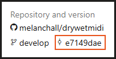

---
uid: a_develop_utility_checkdwmapi
---

# CheckDwmApi

**Melanchall.CheckDwmApi** tool used to check basic functions of DryWetMIDI library. You may be kindly asked to run it to help investigate issues with the library.

If you have questions regarding the utility, please feel free to create an [issue](https://github.com/melanchall/drywetmidi/issues/new) or [discussion](https://github.com/melanchall/drywetmidi/discussions/new/choose) on GitHub, or send an email.

## Downloading the utility

First of all, you need to download the utility. You can find the latest version of it in the _Artifacts_ section of the [latest build](https://dev.azure.com/Melanchall/DryWetMIDI/_build/latest?definitionId=85&branchName=develop):


Clicking on the highlighted button you'll see the list of published utilities. You need to find `CheckDwmApi-<OS>-<CPU-Arch>` plates:


`<OS>` is the operating system you want to run the utility on (_Windows_, _macOS_, _Linux_) and `<CPU-Arch>` is the CPU architecture (_x64_, _ARM64_, etc.). Click on the plate that fits your OS and CPU architecture to download a ZIP archive with the utility:


If you unsure what your CPU architecture is, you can execute a command in your command line shell:

* **Windows**:  
  in cmd:
  ```text
  echo %PROCESSOR_ARCHITECTURE%
  ```
  in PowerShell:
  ```text
  $env:PROCESSOR_ARCHITECTURE
  ```
* **macOS / Linux**:
  ```text
  uname -m
  ```

If you see, for example, `AMD64` or `x86_64`, your CPU architecture is `x64`. If you see `ARM64` or `aarch64`, your CPU architecture is `arm64`. In general, Intel and AMD processors use `x64` architecture, while Apple Silicon (M1, M2 and so on) processors use `arm64` architecture.

Of course, you can see [the source code](https://github.com/melanchall/drywetmidi/tree/develop/Utilities/CheckDwmApi) of the utility. Also you can see exact commit from which it was built:



## Running the utility

> [!WARNING]
> If you're on Windows, you need to have a virtual MIDI device installed to run the utility. For example, you can use [loopMIDI](https://www.tobias-erichsen.de/software/loopmidi.html):
>
> 
> 
> 
> 
> The tool will ask you for the name of a virtual MIDI device to use during the testing process, so you can specify any name and use any application to create a MIDI device (loopMIDI, loopBe1 and so on).

Now you're ready to run the tool. First of all, extract the downloaded archive to any folder you want. After that, navigate to the folder and run the program (just double-click it).

The utility will guide you through the testing process. You just need to follow the instructions shown in the console window.

At the end of the testing process, the utility will generate a report file named **CheckDwmApiReport.txt** in the same folder where the utility is located. The file will be opened automatically after the testing process is finished (or you can open it manually). You can send the content of this file to the DryWetMIDI developer to help investigate issues with the library.

Report will contain exactly what you will see in the console window during the testing process with elapsed time prefixes on each line. For example:

```text
[00:00.008] ================================================================================
[00:00.008] [1] Write system information
[00:00.010] --------------------------------------------------------------------------------
[00:00.010] Writes system information to the report.
[00:00.010] ================================================================================
[00:00.011] Retrieving system information...
[00:00.011] - info providers obtained for the current OS
[00:00.013] Retrieving CpuArchitecture...
[00:00.018] Executing command: cmd /C echo %PROCESSOR_ARCHITECTURE%
[00:00.036] - waiting process exited for 00:00:10...
[00:00.051] - executed
[00:00.052] - output received
[00:00.052] - CPU arch: AMD64
```