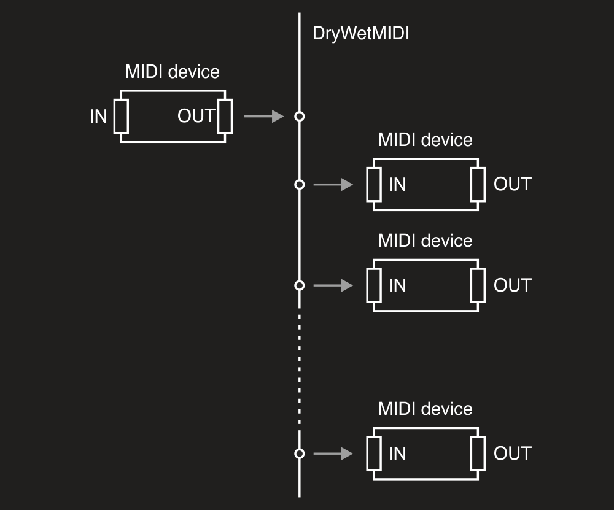

---
uid: a_dev_connector
---

# Devices connector

You can redirect MIDI events from [input endpoint](Input-endpoint.md) to [output endpoint(s)](Output-endpoint.md) using [EndpointsConnector](xref:Melanchall.DryWetMidi.Multimedia.EndpointsConnector) class. To understand what input and output MIDI endpoint is in DryWetMIDI, please read the [Overview](Overview.md) article.

Device connector connects an instance of the [IInputEndpoint](xref:Melanchall.DryWetMidi.Multimedia.IInputEndpoint) to one or multiple instances of the [IOutputEndpoint](xref:Melanchall.DryWetMidi.Multimedia.IOutputEndpoint). To get an instance of `EndpointsConnector` class you can use either its constructor or `Connect` extension method on `IInputEndpoint`. In the first case you need to call the [Connect](xref:Melanchall.DryWetMidi.Multimedia.EndpointsConnector.Connect) method after you get an instance of the `EndpointsConnector`. In the second case the method will be called automatically.

Also you can call [Disconnect](xref:Melanchall.DryWetMidi.Multimedia.EndpointsConnector.Disconnect) at any time to disable connection between devices.

The image below shows how devices will be connected in DryWetMIDI:



Following small example shows basic usage of `EndpointsConnector`:

```csharp
using Melanchall.DryWetMidi.Multimedia;

// ...

using (var inputEndpoint = InputEndpoint.GetByName("MIDI In"))
using (var outputEndpoint1 = OutputEndpoint.GetByName("MIDI Out 1"))
using (var outputEndpoint2 = OutputEndpoint.GetByName("MIDI Out 2"))
{
    var devicesConnector = new EndpointsConnector(inputEndpoint, outputEndpoint1, outputEndpoint2);
    devicesConnector.Connect();
}
```

So if a MIDI event is received by _MIDI In_ device, the event will be sent to both _MIDI Out 1_ and _MIDI Out 2_.

Don't forget to call [StartEventsListening](xref:Melanchall.DryWetMidi.Multimedia.IInputEndpoint.StartEventsListening) on input device to make sure [EventReceived](xref:Melanchall.DryWetMidi.Multimedia.IInputEndpoint.EventReceived) will be fired and MIDI event redirected to output devices. Read more in the [Input endpoint](Input-endpoint.md) article.