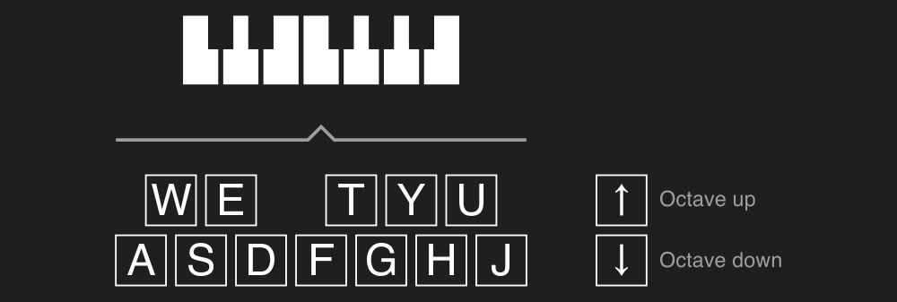

---
uid: a_dev_input
---

# Input endpoint

In DryWetMIDI an input MIDI endpoint is represented by the [IInputEndpoint](xref:Melanchall.DryWetMidi.Multimedia.IInputEndpoint) interface. It allows to receive events from a MIDI device. To understand what an input MIDI endpoint is in DryWetMIDI, please read the [Overview](Overview.md) article.

The library provides built-in implementation of `IInputEndpoint`: [InputEndpoint](xref:Melanchall.DryWetMidi.Multimedia.InputEndpoint) class. To get an instance of `InputEndpoint` you can use [GetByName](xref:Melanchall.DryWetMidi.Multimedia.InputEndpoint.GetByName(System.String)) static method. ID of a MIDI endpoint is a number from `0` to _endpoints count minus one_. To get count of input MIDI endpoints presented in the system there is the [GetEndpointsCount](xref:Melanchall.DryWetMidi.Multimedia.InputEndpoint.GetEndpointsCount) method. You can get all input MIDI endpoints with the [GetAll](xref:Melanchall.DryWetMidi.Multimedia.InputEndpoint.GetAll) method.

> [!WARNING]
> You can use `InputEndpoint` built-in implementation of `IInputEndpoint` only on the systems listed in the [Supported OS](xref:a_develop_supported_os) article. Of course you can create your own implementation of `IInputEndpoint` as described in the [Custom input endpoint](#custom-input-endpoint) section below.

After an instance of `InputEndpoint` is obtained, call [StartEventsListening](xref:Melanchall.DryWetMidi.Multimedia.IInputEndpoint.StartEventsListening) to start listening to incoming MIDI events going from an input MIDI device. If you don't need to listen for events anymore, call [StopEventsListening](xref:Melanchall.DryWetMidi.Multimedia.IInputEndpoint.StopEventsListening). Also this method will be called automatically on [Dispose](xref:Melanchall.DryWetMidi.Multimedia.MidiEndpoint.Dispose). To check whether `InputEndpoint` is currently listening for events or not use [IsListeningForEvents](xref:Melanchall.DryWetMidi.Multimedia.IInputEndpoint.IsListeningForEvents) property.

If an input device is listening for events, it will fire the [EventReceived](xref:Melanchall.DryWetMidi.Multimedia.IInputEndpoint.EventReceived) event for each incoming MIDI event. Received MIDI event will be passed to an event's handler.

> [!WARNING]
> If you use an instance of the `InputEndpoint` within a `using` block, you need to be very careful. In general it's not a good practice and can cause problems. For example, with this code
> ```csharp
> using (var inputEndpoint = InputEndpoint.GetByName("Some MIDI device"))
> {
>     inputEndpoint.EventReceived += OnEventReceived;
>     inputEndpoint.StartEventsListening();
> }
> 
> // ...
> 
> private static void OnEventReceived(object? sender, MidiEventReceivedEventArgs e)
> {
>     // ...
> }
> ```
> the `OnEventReceived` method will not be probably called at all since the program leaves the `using` block before any event is received, and thus the device instance will be destroyed and not functioning of course.

Small example (console app) that shows receiving MIDI data:

```csharp
using System;
using Melanchall.DryWetMidi.Multimedia;

namespace InputEndpointExample
{
    class Program
    {
        private static IInputEndpoint _inputEndpoint;

        static void Main(string[] args)
        {
            _inputEndpoint = InputEndpoint.GetByName("Some MIDI device");
            _inputEndpoint.EventReceived += OnEventReceived;
            _inputEndpoint.StartEventsListening();

            Console.WriteLine("Input device is listening for events. Press any key to exit...");
            Console.ReadKey();

            (_inputEndpoint as IDisposable)?.Dispose();
        }

        private static void OnEventReceived(object sender, MidiEventReceivedEventArgs e)
        {
            var midiEndpoint = (MidiEndpoint)sender;
            Console.WriteLine($"Event received from '{midiEndpoint.Name}' at {DateTime.Now}: {e.Event}");
        }
    }
}
```

> [!WARNING]
> You must always take care about disposing an `InputEndpoint`, so use it inside `using` block or call `Dispose` manually. Without it all resources taken by the endpoint will live until GC collects them via the finalizer of the `InputEndpoint`. It means that sometimes you will not be able to use different instances of the same endpoint across multiple applications or different pieces of a program.

`InputEndpoint` has the [MidiTimeCodeReceived](xref:Melanchall.DryWetMidi.Multimedia.InputEndpoint.MidiTimeCodeReceived) event which, by default, will be fired only when **all** MIDI Time Code components (separate [MidiTimeCodeEvent](xref:Melanchall.DryWetMidi.Core.MidiTimeCodeEvent) events) are received forming _hours:minutes:seconds:frames_ timestamp. You can turn this behavior off by setting [RaiseMidiTimeCodeReceived](xref:Melanchall.DryWetMidi.Multimedia.InputEndpoint.RaiseMidiTimeCodeReceived) to `false`.

If an invalid [channel](xref:Melanchall.DryWetMidi.Core.ChannelEvent), [system common](xref:Melanchall.DryWetMidi.Core.SystemCommonEvent) or [system real-time](xref:Melanchall.DryWetMidi.Core.SystemRealTimeEvent) or system exclusive event received, [ErrorOccurred](xref:Melanchall.DryWetMidi.Multimedia.MidiEndpoint.ErrorOccurred) event will be fired with the `Data` property of the exception filled with information about the error.

## Custom input endpoint

You can create your own input endpoint implementation and use it in your app. For example, let's create an endpoint that will listen for specific keyboard keys and report corresponding notes via the [EventReceived](xref:Melanchall.DryWetMidi.Multimedia.IInputEndpoint.EventReceived) event. Also we will control the current octave with _up arrow_ and _down arrow_ keys increasing or decreasing octave number correspondingly. Following image shows the scheme of our endpoint:



Now we implement it:

```csharp
public sealed class KeyboardInputEndpoint : IInputEndpoint
{
    public event EventHandler<MidiEventReceivedEventArgs> EventReceived;

    private static readonly Dictionary<ConsoleKey, NoteName> NotesNames = new Dictionary<ConsoleKey, NoteName>
    {
        [ConsoleKey.A] = NoteName.C,
        [ConsoleKey.W] = NoteName.CSharp,
        [ConsoleKey.S] = NoteName.D,
        [ConsoleKey.E] = NoteName.DSharp,
        [ConsoleKey.D] = NoteName.E,
        [ConsoleKey.F] = NoteName.F,
        [ConsoleKey.T] = NoteName.FSharp,
        [ConsoleKey.G] = NoteName.G,
        [ConsoleKey.Y] = NoteName.GSharp,
        [ConsoleKey.H] = NoteName.A,
        [ConsoleKey.U] = NoteName.ASharp,
        [ConsoleKey.J] = NoteName.B
    };

    private readonly Thread _thread;
            
    private int _octaveNumber = 4;
    private SevenBitNumber? _currentNoteNumber;

    public KeyboardInputDevice()
    {
        _thread = new Thread(ListenEvents);
    }

    public bool IsListeningForEvents { get; private set; }

    public void StartEventsListening()
    {
        _thread.Start();
        IsListeningForEvents = true;
    }

    public void StopEventsListening()
    {
        if (_currentNoteNumber != null)
            EventReceived?.Invoke(this, new MidiEventReceivedEventArgs(
                new NoteOffEvent(_currentNoteNumber.Value, SevenBitNumber.MinValue)));

        IsListeningForEvents = false;
    }

    public void Dispose()
    {
    }

    private void ListenEvents()
    {
        while (IsListeningForEvents)
        {
            var key = Console.ReadKey(true);
            if (!NotesNames.TryGetValue(key.Key, out var noteName))
            {
                switch (key.Key)
                {
                    case ConsoleKey.UpArrow:
                        _octaveNumber++;
                        Console.WriteLine($"Octave is {_octaveNumber} now");
                        break;
                    case ConsoleKey.DownArrow:
                        _octaveNumber--;
                        Console.WriteLine($"Octave is {_octaveNumber} now");
                        break;
                    case ConsoleKey.Escape:
                        StopEventsListening();
                        Console.WriteLine("Listening stopped.");
                        break;
                }

                continue;
            }

            var noteNumber = CalculateNoteNumber(noteName, _octaveNumber);
            if (!IsNoteNumberValid(noteNumber))
                continue;

            if (_currentNoteNumber != null)
                EventReceived?.Invoke(this, new MidiEventReceivedEventArgs(
                    new NoteOffEvent(_currentNoteNumber.Value, SevenBitNumber.MinValue)));

            EventReceived?.Invoke(this, new MidiEventReceivedEventArgs(
                new NoteOnEvent((SevenBitNumber)noteNumber, SevenBitNumber.MaxValue)));

            _currentNoteNumber = (SevenBitNumber)noteNumber;
        }
    }

    private static bool IsNoteNumberValid(int noteNumber)
    {
        return noteNumber >= SevenBitNumber.MinValue && noteNumber <= SevenBitNumber.MaxValue;
    }

    private static int CalculateNoteNumber(NoteName noteName, int octave)
    {
        return (octave + 1) * Octave.OctaveSize + (int)noteName;
    }
}
```

We can then use it for [Recording](xref:Melanchall.DryWetMidi.Multimedia.Recording) or [redirecting](Endpoints-connector.md) received notes to real output device to make them sound:

```csharp
var outputEndpoint = OutputEndpoint.GetByName("Microsoft GS Wavetable Synth");
var endpointsConnector = keyboardInputEndpoint.Connect(outputEndpoint);
```