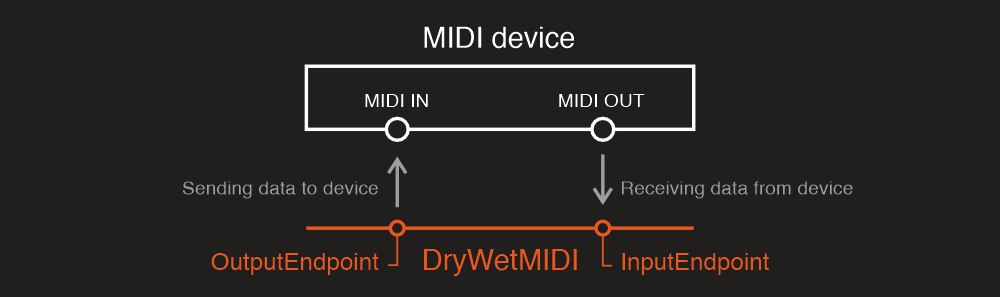

---
uid: a_dev_overview
---

# Overview

DryWetMIDI provides the ability to send MIDI data to or receive it from MIDI devices. For that purpose there are following types:

* [IInputEndpoint](xref:Melanchall.DryWetMidi.Multimedia.IInputEndpoint) (see [Input endpoint](Input-endpoint.md) article);
* [IOutputEndpoint](xref:Melanchall.DryWetMidi.Multimedia.IOutputEndpoint) (see [Output endpoint](Output-endpoint.md) article);
* [EndpointsConnector](xref:Melanchall.DryWetMidi.Multimedia.EndpointsConnector) (see [Endpoints connector](Endpoints-connector.md) article).

The library provides implementations for both `IInputEndpoint` and `IOutputEndpoint`: [InputEndpoint](xref:Melanchall.DryWetMidi.Multimedia.InputEndpoint) and [OutputEndpoint](xref:Melanchall.DryWetMidi.Multimedia.OutputEndpoint) correspondingly which represent MIDI devices visible by the operating system. Both classes implement [IDisposable](xref:System.IDisposable) interface so you should always dispose of them to free devices for use by other applications.

> [!WARNING]
> You can use `InputEndpoint` and `OutputEndpoint` built-in implementations of `IInputEndpoint` and `IOutputEndpoint` only on the systems listed in the [Supported OS](xref:a_develop_supported_os) article. Of course you can create your own implementations of `IInputEndpoint` and `IOutputEndpoint`.

All classes that interact with devices work with interfaces mentioned above, so you can create custom implementations of your devices (see examples in [Input endpoint](Input-endpoint.md) and [Output endpoint](Output-endpoint.md) articles) and use it for playback or recording, for example.

MIDI devices API classes are placed in the [Melanchall.DryWetMidi.Multimedia](xref:Melanchall.DryWetMidi.Multimedia) namespace.

To understand what is an input and an output endpoint in DryWetMIDI take a look at the following image:

So, as you can see, although a MIDI port is _MIDI IN_ for a MIDI device, it will be an **output endpoint** in DryWetMIDI because your application will **send MIDI data to** this port. _MIDI OUT_ of MIDI device will be an **input endpoint** in DryWetMIDI because a program will **receive MIDI data from** the port.

If some error occurred during sending or receiving a MIDI event, the [ErrorOccurred](xref:Melanchall.DryWetMidi.Multimedia.MidiEndpoint.ErrorOccurred) event will be fired holding an exception caused by the error.
