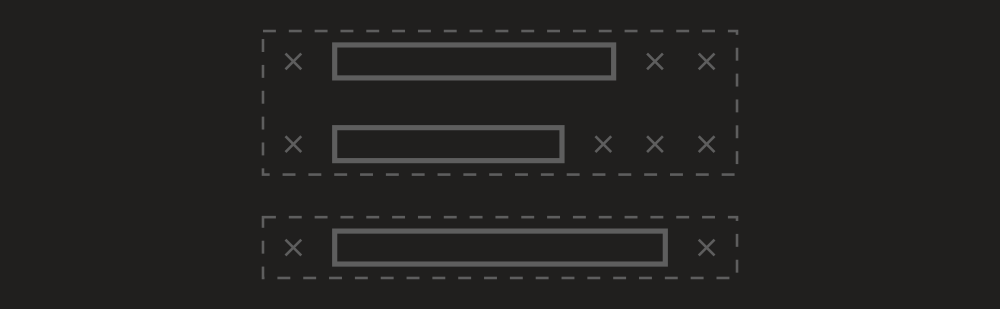
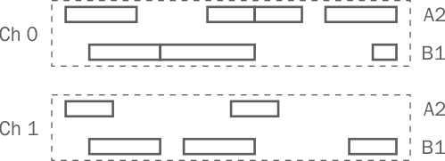
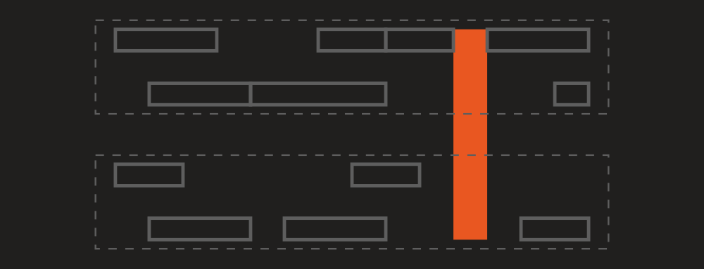
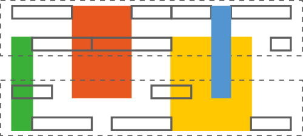

# Getting objects

This article describes ways to get different objects (like [timed events](xref:Melanchall.DryWetMidi.Interaction.TimedEvent) or [notes](xref:Melanchall.DryWetMidi.Interaction.Note)) from MIDI files, track chunks and collections of another objects.

## GetTimedEvents

`TimedEvent` is the basic MIDI object we will describe here. It's just a MIDI event along with its absolute time within a MIDI file or track chunk. You can read more in [Events absolute time](xref:a_events_abs_time) article. To get all timed events in a MIDI file, you can just call [GetTimedEvents](xref:Melanchall.DryWetMidi.Interaction.TimedEventsManagingUtilities.GetTimedEvents(Melanchall.DryWetMidi.Core.MidiFile)) method:

```csharp
using System;
using Melanchall.DryWetMidi.Core;
using Melanchall.DryWetMidi.Interaction;

namespace DwmExamples
{
    class Program
    {
        static void Main(string[] args)
        {
            var midiFile = MidiFile.Read("My Great Song.mid");
            var timedEvents = midiFile.GetTimedEvents();

            Console.WriteLine($"{timedEvents.Count} timed events found.");
        }
    }
}
```

Please examine [TimedEventsManagingUtilities](xref:Melanchall.DryWetMidi.Interaction.TimedEventsManagingUtilities) class to see other `GetTimedEvents` overloads.

## GetNotes

There is the [NotesManagingUtilities](xref:Melanchall.DryWetMidi.Interaction.NotesManagingUtilities) class which provides useful methods `GetNotes` to get notes from a MIDI file or track chunk. For example, you can get notes a MIDI file contains with this code:

```csharp
using System;
using Melanchall.DryWetMidi.Common;
using Melanchall.DryWetMidi.Core;
using Melanchall.DryWetMidi.Interaction;

namespace DwmExamples
{
    class Program
    {
        static void Main(string[] args)
        {
            var midiFile = new MidiFile(
                new TrackChunk(
                    new NoteOnEvent(),
                    new NoteOffEvent(),
                    new NoteOnEvent((SevenBitNumber)70, (SevenBitNumber)50)
                    {
                        Channel = (FourBitNumber)5,
                        DeltaTime = 10
                    },
                    new NoteOffEvent((SevenBitNumber)70, (SevenBitNumber)30)
                    {
                        Channel = (FourBitNumber)5,
                        DeltaTime = 70
                    }));

            Console.WriteLine("Notes:");

            foreach (var note in midiFile.GetNotes())
            {
                Console.Write($@"
note {note} (note number = {note.NoteNumber})
  time = {note.Time}
  length = {note.Length}
  velocity = {note.Velocity}
  off velocity = {note.OffVelocity}");
            }

            Console.ReadKey();
        }
    }
}
```

Running the program, we'll see following output:

```text
Notes:

note C-1 (note number = 0)
  time = 0
  length = 0
  velocity = 0
  off velocity = 0
note A#4 (note number = 70)
  time = 10
  length = 70
  velocity = 50
  off velocity = 30
```

Please examine [NotesManagingUtilities](xref:Melanchall.DryWetMidi.Interaction.NotesManagingUtilities) class to see other `GetNotes` overloads.

### Settings

All `GetNotes` overloads can accept [NoteDetectionSettings](xref:Melanchall.DryWetMidi.Interaction.NoteDetectionSettings) as last parameter. Via this parameter you can adjust the process of notes building. Let's see each setting in details.

#### `NoteStartDetectionPolicy`

The [NoteStartDetectionPolicy](xref:Melanchall.DryWetMidi.Interaction.NoteDetectionSettings.NoteStartDetectionPolicy) property defines how start event of a note should be found in case of overlapping notes with the same note number and channel. The default value is [NoteStartDetectionPolicy.FirstNoteOn](xref:Melanchall.DryWetMidi.Interaction.NoteStartDetectionPolicy.FirstNoteOn).

To understand how this policy works let's take a look at the following events sequence:


where empty circle and filled one mean _Note On_ and _Note Off_ events correspondingly; cross means any other event. So we have two overlapped notes here (we assume all note events have the same note number and channel).

If we set `NoteStartDetectionPolicy` to [NoteStartDetectionPolicy.FirstNoteOn](xref:Melanchall.DryWetMidi.Interaction.NoteStartDetectionPolicy.FirstNoteOn), notes will be constructed in following way:


So every _Note Off_ event will be combined with **first** free _Note On_ event into a note (events are processed one by one consecutively). But if set `NoteStartDetectionPolicy` to [NoteStartDetectionPolicy.LastNoteOn](xref:Melanchall.DryWetMidi.Interaction.NoteStartDetectionPolicy.LastNoteOn), we'll get another picture:


So _Note Off_ events will be combined with **last** free _Note On_ event into a note.

#### `NoteSearchContext`

The [NoteSearchContext](xref:Melanchall.DryWetMidi.Interaction.NoteDetectionSettings.NoteSearchContext) property defines a context to search notes within. The default value is [NoteSearchContext.SingleEventsCollection](xref:Melanchall.DryWetMidi.Interaction.NoteSearchContext.SingleEventsCollection). The property is applicable only to `GetChords` that accepts collection of [TrackChunk](xref:Melanchall.DryWetMidi.Core.TrackChunk)s and [MidiFile](xref:Melanchall.DryWetMidi.Core.MidiFile).

To understand how this policy works let's take a look at the following events sequences within two track chunks:


where empty circle and filled one mean _Note On_ and _Note Off_ events correspondingly; cross means any other event. So we have two overlapped notes here (we assume all note events have the same note number). So we have two overlapped notes here. We assume that [NoteStartDetectionPolicy.FirstNoteOn](xref:Melanchall.DryWetMidi.Interaction.NoteStartDetectionPolicy.FirstNoteOn) is used to search a note's start and all note events have the same note number.

If we use [NoteSearchContext.SingleEventsCollection](xref:Melanchall.DryWetMidi.Interaction.NoteSearchContext.SingleEventsCollection) as the context, notes will be constructed in the following way:


So every _Note On_ event will be combined with _Note Off_ one within the **same** events collection. But if we use [NoteSearchContext.AllEventsCollections](xref:Melanchall.DryWetMidi.Interaction.NoteSearchContext.AllEventsCollections), notes will be constructed in a new way:


So _Note On_ event can be combined now with _Note Off_ one within **different** events collection, i.e. ends of a note can be placed in difefrent track chunks.

## GetChords

There is the [ChordsManagingUtilities](xref:Melanchall.DryWetMidi.Interaction.ChordsManagingUtilities) class which provides useful methods `GetChords` to get notes from a MIDI file or track chunk. For example, you can get chords a MIDI file contains with this code:

```csharp
using System;
using Melanchall.DryWetMidi.Common;
using Melanchall.DryWetMidi.Core;
using Melanchall.DryWetMidi.Interaction;

namespace DwmExamples
{
    class Program
    {
        static void Main(string[] args)
        {
            var midiFile = new MidiFile(
                new TrackChunk(
                    new NoteOnEvent(),
                    new NoteOffEvent(),
                    new NoteOnEvent
                    {
                        Channel = (FourBitNumber)5,
                        DeltaTime = 10
                    },
                    new NoteOffEvent
                    {
                        Channel = (FourBitNumber)5
                    },
                    new NoteOnEvent((SevenBitNumber)70, (SevenBitNumber)50)
                    {
                        Channel = (FourBitNumber)5
                    },
                    new NoteOffEvent((SevenBitNumber)70, (SevenBitNumber)30)
                    {
                        Channel = (FourBitNumber)5,
                        DeltaTime = 70
                    }));

            Console.WriteLine("Chords:");

            foreach (var chord in midiFile.GetChords())
            {
                Console.Write($@"
chord
  channel = {chord.Channel}
  time = {chord.Time}
  length = {chord.Length}
  notes:");

                foreach (var note in chord.Notes)
                {

                    Console.Write($@"
  note {note} (note number = {note.NoteNumber})
    channel = {note.Channel}
    time = {note.Time}
    length = {note.Length}
    velocity = {note.Velocity}
    off velocity = {note.OffVelocity}");
                }
            }

            Console.ReadKey();
        }
    }
}
```

Running the program, we'll see following output:

```text
Chords:

chord
  channel = 0
  time = 0
  length = 0
  notes:
  note C-1 (note number = 0)
    channel = 0
    time = 0
    length = 0
    velocity = 0
    off velocity = 0
chord
  channel = 5
  time = 10
  length = 70
  notes:
  note C-1 (note number = 0)
    channel = 5
    time = 10
    length = 0
    velocity = 0
    off velocity = 0
  note A#4 (note number = 70)
    channel = 5
    time = 10
    length = 70
    velocity = 50
    off velocity = 30
```

Please examine [ChordsManagingUtilities](xref:Melanchall.DryWetMidi.Interaction.ChordsManagingUtilities) class to see other `GetChords` overloads.

### Settings

All `GetChords` overloads can accept [ChordDetectionSettings](xref:Melanchall.DryWetMidi.Interaction.ChordDetectionSettings) as last parameter. Via this parameter you can adjust the process of chords building. Let's see each setting in details.

#### `NoteDetectionSettings`

Chords are built on top of notes. So to build chords we need to build notes. The process of notes building is adjustable via [NoteDetectionSettings](xref:Melanchall.DryWetMidi.Interaction.ChordDetectionSettings.NoteDetectionSettings) property. Properties of the [NoteDetectionSettings](xref:Melanchall.DryWetMidi.Interaction.NoteDetectionSettings) are described in detail [above](#settings).

#### `NotesTolerance`

The [NotesTolerance](xref:Melanchall.DryWetMidi.Interaction.ChordDetectionSettings.NotesTolerance) property defines the maximum distance of notes from the start of the first note of a chord. Notes within this tolerance will be included in a chord. The default value is `0`.

To understand how this property works let's take a look at the following notes (cross means any non-note event):


If we set notes tolerance to `0` (which is default value), we'll get three different chords (each of one note):


Different colors denotes different chords. If we set notes tolerance to `1`, we'll get two chords:


With tolerance of `2` we'll finally get a single chord:


#### `NotesMinCount`

The [NotesMinCount](xref:Melanchall.DryWetMidi.Interaction.ChordDetectionSettings.NotesMinCount) property defines the minimum count of notes a chord can contain. So if count of simultaneously sounding notes is less than this value, they won't make up a chord. The default value is `1` which means a single note can be turned to a chord.

To understand how this property works let's take a look at the following notes (cross means any non-note event):


So we have three notes. For simplicity we'll assume that [NotesTolerance](xref:Melanchall.DryWetMidi.Interaction.ChordDetectionSettings.NotesTolerance) is `0` (default value). If we set notes min count to `1` (which is default value), we'll get two different chords:


If we set notes min count to `2`, we'll get only one chord:


Last note will not be turned into a chord because count of notes for a chord will be `1` which is less than the specified minimum count. With minimum count of notes of `3` we'll get no chords:


First possible chord will contain two notes and second chord will contain one note. In both cases count of notes is less than the specified minimum count.

#### `ChordSearchContext`

The [ChordSearchContext](xref:Melanchall.DryWetMidi.Interaction.ChordDetectionSettings.ChordSearchContext) property defines a context to search chords within. The default value is [ChordSearchContext.SingleEventsCollection](xref:Melanchall.DryWetMidi.Interaction.ChordSearchContext.SingleEventsCollection). The property is applicable only to `GetChords` that accepts collection of [TrackChunk](xref:Melanchall.DryWetMidi.Core.TrackChunk)s and [MidiFile](xref:Melanchall.DryWetMidi.Core.MidiFile).

To understand how this policy works let's take a look at the following data within two track chunks:



If we use [ChordSearchContext.SingleEventsCollection](xref:Melanchall.DryWetMidi.Interaction.ChordSearchContext.SingleEventsCollection) as the context, chords will be constructed in the following way:


So chords will be constructed only from notes within the same events collection (track chunk). But if we use [ChordSearchContext.AllEventsCollections](xref:Melanchall.DryWetMidi.Interaction.ChordSearchContext.AllEventsCollections), chords will be constructed in a new way:


So a chord can be constructed from notes within different events collections.

## GetObjects

All methods we saw before return collection of objects of the **same type**. So you can get only either notes or chords or timed events. To highlight the problem, let's take a look at the following events sequence:


where empty circle and filled one mean _Note On_ and _Note Off_ events correspondingly; cross means any other event. We assume all note events have the same note number and channel.

With `GetTimedEvents` we'll just get all these events as is. `GetNotes` will give us only notes:


`GetChords` will return only chords (single one in this example):


So if we run following simple program:

```csharp
using System;
using System.Collections.Generic;
using Melanchall.DryWetMidi.Core;
using Melanchall.DryWetMidi.Interaction;

namespace DwmExamples
{
    class Program
    {
        static void Main(string[] args)
        {
            var midiFile = new MidiFile(
                new TrackChunk(
                    new TextEvent("1"),
                    new NoteOnEvent { DeltaTime = 1 },
                    new TextEvent("2") { DeltaTime = 1 },
                    new NoteOffEvent { DeltaTime = 1 },
                    new TextEvent("3") { DeltaTime = 1 },
                    new NoteOnEvent { DeltaTime = 1 },
                    new TextEvent("4") { DeltaTime = 1 },
                    new NoteOffEvent { DeltaTime = 1 },
                    new TextEvent("5") { DeltaTime = 1 },
                    new NoteOnEvent { DeltaTime = 1 },
                    new TextEvent("6")),
                new TrackChunk(
                    new TextEvent("A"),
                    new TextEvent("B") { DeltaTime = 1 },
                    new TextEvent("C") { DeltaTime = 1 },
                    new TextEvent("D") { DeltaTime = 1 },
                    new TextEvent("E") { DeltaTime = 1 },
                    new NoteOnEvent { DeltaTime = 1 },
                    new TextEvent("F") { DeltaTime = 1 },
                    new NoteOffEvent { DeltaTime = 1 },
                    new TextEvent("G") { DeltaTime = 1 },
                    new TextEvent("H") { DeltaTime = 1 },
                    new TextEvent("I")));

            Console.WriteLine("Getting timed events...");
            WriteTimedObjects(midiFile.GetTimedEvents());
            Console.WriteLine("Getting notes...");
            WriteTimedObjects(midiFile.GetNotes());
            Console.WriteLine("Getting chords...");
            WriteTimedObjects(midiFile.GetChords(new ChordDetectionSettings
            {
                ChordSearchContext = ChordSearchContext.AllEventsCollections,
                NotesMinCount = 2
            }));

            Console.ReadKey();
        }

        private static void WriteTimedObjects<TObject>(ICollection<TObject> timedObjects)
            where TObject : ITimedObject
        {
            foreach (var timedObject in timedObjects)
            {
                Console.WriteLine($"[{timedObject.GetType().Name}] {timedObject} (time = {timedObject.Time})");
            }
        }
    }
}
```

we'll get this output:

```text
Getting timed events...
[TimedEvent] Event at 0: Text (1) (time = 0)
[TimedEvent] Event at 0: Text (A) (time = 0)
[TimedEvent] Event at 1: Note On [0] (0, 0) (time = 1)
[TimedEvent] Event at 1: Text (B) (time = 1)
[TimedEvent] Event at 2: Text (2) (time = 2)
[TimedEvent] Event at 2: Text (C) (time = 2)
[TimedEvent] Event at 3: Note Off [0] (0, 0) (time = 3)
[TimedEvent] Event at 3: Text (D) (time = 3)
[TimedEvent] Event at 4: Text (3) (time = 4)
[TimedEvent] Event at 4: Text (E) (time = 4)
[TimedEvent] Event at 5: Note On [0] (0, 0) (time = 5)
[TimedEvent] Event at 5: Note On [0] (0, 0) (time = 5)
[TimedEvent] Event at 6: Text (4) (time = 6)
[TimedEvent] Event at 6: Text (F) (time = 6)
[TimedEvent] Event at 7: Note Off [0] (0, 0) (time = 7)
[TimedEvent] Event at 7: Note Off [0] (0, 0) (time = 7)
[TimedEvent] Event at 8: Text (5) (time = 8)
[TimedEvent] Event at 8: Text (G) (time = 8)
[TimedEvent] Event at 9: Note On [0] (0, 0) (time = 9)
[TimedEvent] Event at 9: Text (6) (time = 9)
[TimedEvent] Event at 9: Text (H) (time = 9)
[TimedEvent] Event at 9: Text (I) (time = 9)
Getting notes...
[Note] C-1 (time = 1)
[Note] C-1 (time = 5)
[Note] C-1 (time = 5)
Getting chords...
[Chord] C-1 C-1 (time = 5)
```

As you can see there is "free" _Note On_ event without corresponding _Note Off_ one so we can't build a note for it. What if we want to get all possible notes and all remaining timed events? DryWetMIDI provides [GetObjectsUtilities](xref:Melanchall.DryWetMidi.Interaction.GetObjectsUtilities) class which contains `GetObjects` methods (for the same MIDI structures as previous methods). We can change printing part of the program above to:


```csharp
Console.WriteLine("Getting notes and timed events...");
WriteTimedObjects(midiFile.GetObjects(ObjectType.Note | ObjectType.TimedEvent));
```

which will give us following output:

```text
Getting notes and timed events...
[TimedEvent] Event at 0: Text (1) (time = 0)
[TimedEvent] Event at 0: Text (A) (time = 0)
[Note] C-1 (time = 1)
[TimedEvent] Event at 1: Text (B) (time = 1)
[TimedEvent] Event at 2: Text (2) (time = 2)
[TimedEvent] Event at 2: Text (C) (time = 2)
[TimedEvent] Event at 3: Text (D) (time = 3)
[TimedEvent] Event at 4: Text (3) (time = 4)
[TimedEvent] Event at 4: Text (E) (time = 4)
[Note] C-1 (time = 5)
[Note] C-1 (time = 5)
[TimedEvent] Event at 6: Text (4) (time = 6)
[TimedEvent] Event at 6: Text (F) (time = 6)
[TimedEvent] Event at 8: Text (5) (time = 8)
[TimedEvent] Event at 8: Text (G) (time = 8)
[TimedEvent] Event at 9: Note On [0] (0, 0) (time = 9)
[TimedEvent] Event at 9: Text (6) (time = 9)
[TimedEvent] Event at 9: Text (H) (time = 9)
[TimedEvent] Event at 9: Text (I) (time = 9)
```

So all note events that build up a note were turned into instances of [Note](xref:Melanchall.DryWetMidi.Interaction.Note), and all remaining events (including "free" _Note On_ one) were returned as instances of [TimedEvent](xref:Melanchall.DryWetMidi.Interaction.TimedEvent).

We can go futher and collect all possible chords, notes and timed events:

```csharp
Console.WriteLine("Getting chords, notes and timed events...");
WriteTimedObjects(midiFile.GetObjects(
    ObjectType.Chord | ObjectType.Note | ObjectType.TimedEvent,
    new ObjectDetectionSettings
    {
        ChordDetectionSettings = new ChordDetectionSettings
        {
            ChordSearchContext = ChordSearchContext.AllEventsCollections,
            NotesMinCount = 2
        }
    }));
```

which will give us following output:

```text
Getting chords, notes and timed events...
[TimedEvent] Event at 0: Text (1) (time = 0)
[TimedEvent] Event at 0: Text (A) (time = 0)
[Note] C-1 (time = 1)
[TimedEvent] Event at 1: Text (B) (time = 1)
[TimedEvent] Event at 2: Text (2) (time = 2)
[TimedEvent] Event at 2: Text (C) (time = 2)
[TimedEvent] Event at 3: Text (D) (time = 3)
[TimedEvent] Event at 4: Text (3) (time = 4)
[TimedEvent] Event at 4: Text (E) (time = 4)
[Chord] C-1 C-1 (time = 5)
[TimedEvent] Event at 6: Text (4) (time = 6)
[TimedEvent] Event at 6: Text (F) (time = 6)
[TimedEvent] Event at 8: Text (5) (time = 8)
[TimedEvent] Event at 8: Text (G) (time = 8)
[TimedEvent] Event at 9: Note On [0] (0, 0) (time = 9)
[TimedEvent] Event at 9: Text (6) (time = 9)
[TimedEvent] Event at 9: Text (H) (time = 9)
[TimedEvent] Event at 9: Text (I) (time = 9)
```

Or in visual representation:


Currently `GetObjects` can build objects of the following types:

* [TimedEvent](xref:Melanchall.DryWetMidi.Interaction.TimedEvent)
* [Note](xref:Melanchall.DryWetMidi.Interaction.Note)
* [Chord](xref:Melanchall.DryWetMidi.Interaction.Chord)
* [Rest](xref:Melanchall.DryWetMidi.Interaction.Rest)

### Rests

Let's see on rests building in details, since `GetObjects` is the only way to get them. First of all, all `GetObjects` overloads accept settings as an instance of the [ObjectDetectionSettings](xref:Melanchall.DryWetMidi.Interaction.ObjectDetectionSettings) class. Most of its properties are already discussed in previous sections on [notes building settings](#settings) and [chords building ones](#settings-1). But there is the [RestDetectionSettings](xref:Melanchall.DryWetMidi.Interaction.ObjectDetectionSettings.RestDetectionSettings) property which controls how rests should be detected.

Supposing we have following notes (with two different note numbers on two different channels):



[RestDetectionSettings](xref:Melanchall.DryWetMidi.Interaction.RestDetectionSettings) provides [RestSeparationPolicy](xref:Melanchall.DryWetMidi.Interaction.RestDetectionSettings.RestSeparationPolicy) property which determines a rule for creating rests. Now we'll see how each possible value of the policy affects the result of rests building.

Using [NoSeparation](xref:Melanchall.DryWetMidi.Interaction.RestSeparationPolicy.NoSeparation) (which is the default value) we'll get only one rest:



_"No separation"_ means _"there is no difference between channels and note numbers"_ so rests will be constructed only at spaces where there are no notes at all (with any channels and any note numbers).

With [SeparateByChannel](xref:Melanchall.DryWetMidi.Interaction.RestSeparationPolicy.SeparateByChannel) we'll get three rests:


So rests are separated by channels only. Note number of a note doesn't matter, all numbers are treated as the same one. So rests will be constructed for each channel at spaces where there are no notes (with any note numbers).

With [SeparateByNoteNumber](xref:Melanchall.DryWetMidi.Interaction.RestSeparationPolicy.SeparateByNoteNumber) we'll get following rests:



As you can see rests now are separated by note number (channel doesn't matter). So rests will be constructed for each note number at spaces where there are no notes (with any channel).

With [SeparateByChannelAndNoteNumber](xref:Melanchall.DryWetMidi.Interaction.RestSeparationPolicy.SeparateByChannelAndNoteNumber) we'll get rests at every "free" space:


Let's see all these processes in action with a small program:

```csharp
using System;
using System.Collections.Generic;
using System.Linq;
using Melanchall.DryWetMidi.Common;
using Melanchall.DryWetMidi.Interaction;
using NoteName = Melanchall.DryWetMidi.MusicTheory.NoteName;

namespace DwmExamples
{
    class Program
    {
        static void Main(string[] args)
        {
            var ch0 = (FourBitNumber)0;
            var a2Ch0Notes = new[]
            {
                new Note(NoteName.A, 2, 3, 0) { Channel = ch0 },
                new Note(NoteName.A, 2, 2, 6) { Channel = ch0 },
                new Note(NoteName.A, 2, 2, 8) { Channel = ch0 },
                new Note(NoteName.A, 2, 3, 11) { Channel = ch0 }
            };
            var b1Ch0Notes = new[]
            {
                new Note(NoteName.B, 1, 3, 1) { Channel = ch0 },
                new Note(NoteName.B, 1, 4, 4) { Channel = ch0 },
                new Note(NoteName.B, 1, 1, 13) { Channel = ch0 }
            };

            var ch1 = (FourBitNumber)1;
            var a2Ch1Notes = new[]
            {
                new Note(NoteName.A, 2, 2, 0) { Channel = ch1 },
                new Note(NoteName.A, 2, 2, 7) { Channel = ch1 }
            };
            var b1Ch1Notes = new[]
            {
                new Note(NoteName.B, 1, 3, 1) { Channel = ch1 },
                new Note(NoteName.B, 1, 3, 5) { Channel = ch1 },
                new Note(NoteName.B, 1, 2, 12) { Channel = ch1 }
            };

            var notes = a2Ch0Notes
                .Concat(b1Ch0Notes)
                .Concat(a2Ch1Notes)
                .Concat(b1Ch1Notes)
                .ToArray();

            WriteRests(notes, RestSeparationPolicy.NoSeparation);
            WriteRests(notes, RestSeparationPolicy.SeparateByChannel);
            WriteRests(notes, RestSeparationPolicy.SeparateByNoteNumber);
            WriteRests(notes, RestSeparationPolicy.SeparateByChannelAndNoteNumber);

            Console.ReadKey();
        }

        private static void WriteRests(
            ICollection<Note> notes,
            RestSeparationPolicy restSeparationPolicy)
        {
            var rests = notes
                .GetObjects(
                    ObjectType.Rest,
                    new ObjectDetectionSettings
                    {
                        RestDetectionSettings = new RestDetectionSettings
                        {
                            RestSeparationPolicy = restSeparationPolicy
                        }
                    })
                .Cast<Rest>()
                .ToArray();

            Console.WriteLine($"Rests by {restSeparationPolicy} policy:");

            foreach (var rest in rests)
            {
                Console.WriteLine($"[{rest.Length}] at [{rest.Time}] (note number = {rest.NoteNumber}, channel = {rest.Channel})");
            }
        }
    }
}
```

Output is:

```text
Rests by NoSeparation policy:
[1] at [10] (note number = , channel = )
Rests by SeparateByChannel policy:
[1] at [4] (note number = , channel = 1)
[3] at [9] (note number = , channel = 1)
[1] at [10] (note number = , channel = 0)
Rests by SeparateByNoteNumber policy:
[1] at [0] (note number = 35, channel = )
[3] at [3] (note number = 45, channel = )
[4] at [8] (note number = 35, channel = )
[1] at [10] (note number = 45, channel = )
Rests by SeparateByChannelAndNoteNumber policy:
[1] at [0] (note number = 35, channel = 0)
[1] at [0] (note number = 35, channel = 1)
[5] at [2] (note number = 45, channel = 1)
[3] at [3] (note number = 45, channel = 0)
[1] at [4] (note number = 35, channel = 1)
[4] at [8] (note number = 35, channel = 1)
[5] at [8] (note number = 35, channel = 0)
[1] at [10] (note number = 45, channel = 0)
```