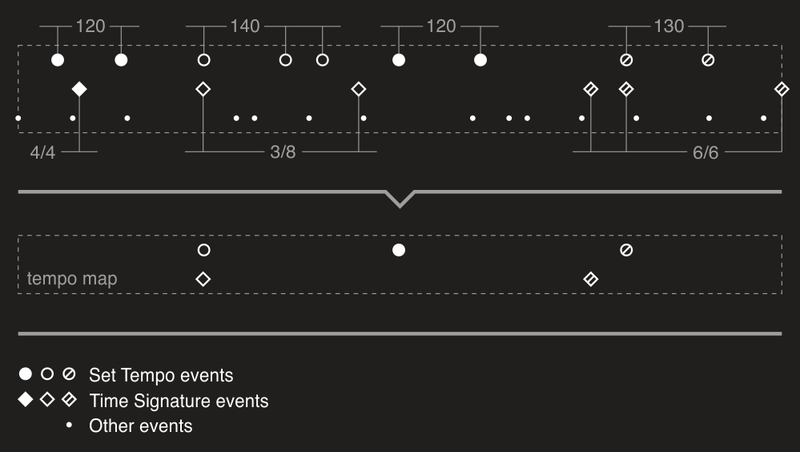

# Tempo map

Tempo map is a set of changes of time signature and tempo. Tempo map is one of the key objects in high-level managing of MIDI data. You need to have a tempo map to convert [time and length](Time-and-length.md) between different representations, either explicitly or internally at some parts of the library (for example, in [tools](xref:a_tools_overview)). Following image shows how tempo map constructed for a given set of events or MIDI file:



So as you can see tempo map doesn't reflect original MIDI events. Tempo map holds real tempo and time signature changes. Default tempo is 120 BPM by MIDI specifications so there is no need to hold first two tempo "changes" because tempo is not changed in fact. The same for time signature (which is `4/4` by default). Also any repeated values are ignored since they don't change tempo or time signature.

Instead of messing with [Time Signature](xref:Melanchall.DryWetMidi.Core.TimeSignatureEvent) and [Set Tempo](xref:Melanchall.DryWetMidi.Core.SetTempoEvent) events DryWetMIDI provides [TempoMapManager](xref:Melanchall.DryWetMidi.Interaction.TempoMapManager) which helps to manage tempo map of a MIDI file:

```csharp
using (var tempoMapManager = new TempoMapManager(
    midiFile.TimeDivision,
    midiFile.GetTrackChunks().Select(c => c.Events)))
{
    TempoMap tempoMap = tempoMapManager.TempoMap;

    Tempo tempoAt123 = tempoMap.GetTempoAtTime((MidiTimeSpan)123);

    // Change tempo to 400000 microseconds per quarter note at 20 seconds from
    // MIDI file start
    tempoMapManager.SetTempo(new MetricTimeSpan(0, 0, 20), new Tempo(400000));

    tempoMapManager.ClearTimeSignature(456);
}
```

To get tempo map being managed by the current `TempoMapManager` you need to use [TempoMap](xref:Melanchall.DryWetMidi.Interaction.TempoMapManager.TempoMap) property which returns an instance of the [TempoMap](xref:Melanchall.DryWetMidi.Interaction.TempoMap) class.

Once you've got an instance of [TempoMap](xref:Melanchall.DryWetMidi.Interaction.TempoMap) you can use [GetTempoChanges](xref:Melanchall.DryWetMidi.Interaction.TempoMap.GetTempoChanges) method to get all tempo changes. Use [GetTimeSignatureChanges](xref:Melanchall.DryWetMidi.Interaction.TempoMap.GetTimeSignatureChanges) method to get time signature changes. [GetTempoAtTime](xref:Melanchall.DryWetMidi.Interaction.TempoMap.GetTempoAtTime(Melanchall.DryWetMidi.Interaction.ITimeSpan)) and [GetTimeSignatureAtTime](xref:Melanchall.DryWetMidi.Interaction.TempoMap.GetTimeSignatureAtTime(Melanchall.DryWetMidi.Interaction.ITimeSpan)) methods allow to get tempo and time signature at the specified time.

You can also create new tempo map with `TempoMapManager`:

```csharp
using (var tempoMapManager = new TempoMapManager())
{
    // ...
}
```

If you want to create a simple tempo map with some fixed tempo or/and time signature without changes, use [Create](xref:Melanchall.DryWetMidi.Interaction.TempoMap.Create*) static methods of the `TempoMap` class.

There is another way to get an instance of the `TempoMapManager` – through the [ManageTempoMap](xref:Melanchall.DryWetMidi.Interaction.TempoMapManagingUtilities.ManageTempoMap*) extension method:

```csharp
using (var tempoMapManager = midiFile.ManageTempoMap())
{
    // ...
}
```

This method and another useful ones are placed in [TempoMapManagingUtilities](xref:Melanchall.DryWetMidi.Interaction.TempoMapManagingUtilities). For example, to get tempo map of a MIDI file you can write:

```csharp
TempoMap tempoMap = midiFile.GetTempoMap();
```

Also you can replace the entire tempo map of a MIDI file using [ReplaceTempoMap](xref:Melanchall.DryWetMidi.Interaction.TempoMapManagingUtilities.ReplaceTempoMap*) method:

```csharp
midiFile.ReplaceTempoMap(TempoMap.Create(Tempo.FromBeatsPerMinute(140)));
```