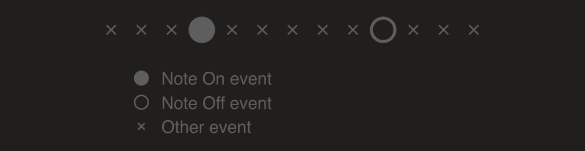
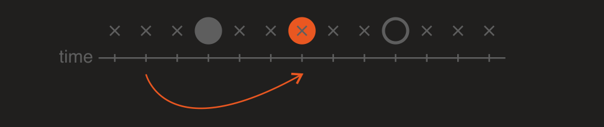
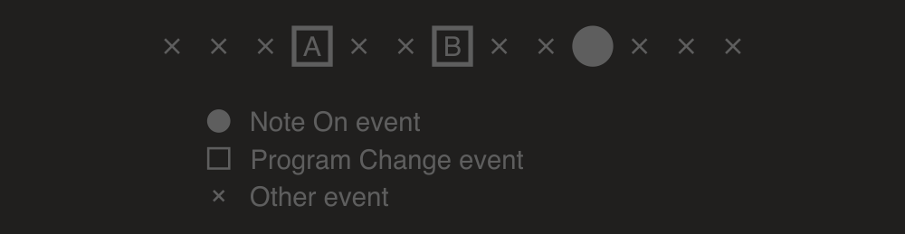
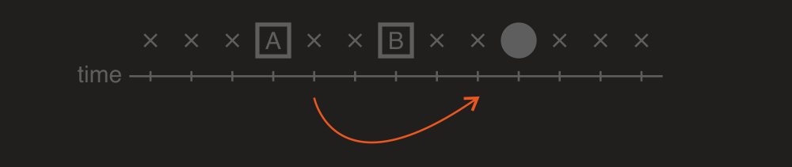
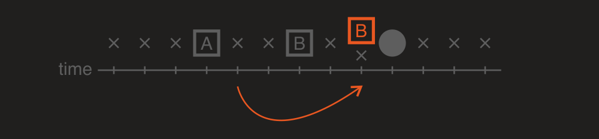
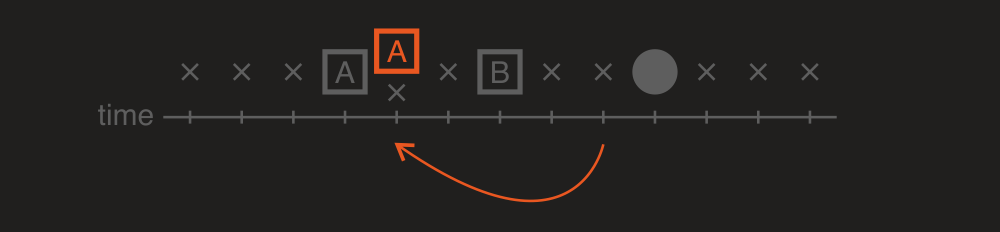

---
uid: a_playback_datatrack
---

# Playback data tracking

[Playback](xref:Melanchall.DryWetMidi.Multimedia.Playback) provides a way to track some MIDI data to correctly handle jumps in time and get properly sounding data. There are two main groups of data to track:

* [notes](#notes-tracking)
* [MIDI parameters](#midi-parameters-values-tracking) (pitch bend, program, control value)

## Notes tracking

Let's take a look at the following events sequence to play:

`Playback` class has [TrackNotes](xref:Melanchall.DryWetMidi.Multimedia.Playback.TrackNotes) property. If its value is `true`, playback will internally construct notes based on input objects to play. So in our example one note will be constructed:

Now let's imagine a playback's time is at some point and we want to jump to a new one (with [MoveToTime](xref:Melanchall.DryWetMidi.Multimedia.Playback.MoveToTime(Melanchall.DryWetMidi.Interaction.ITimeSpan)) for example):

If we now jump to a new time that falls in the middle of the note, behavior of the playback will be different depending on `TrackNotes` property value. In case of the property value is `false` nothing special will happen, just the current time of the playback will be changed. But if we set `TrackNotes` to `true`, new _Note On_ event will be generated and played when we jump to the new time:

The same situation with opposite case:

So we want here to jump from the middle of a note to the time after the note. As in previous example if `TrackNotes` is `false`, just the current time of the playback will be changed. But if in case of `true`, new _Note Off_ event will be generated and played when we jump to the new time.

So `TrackNotes = true` tells playback to track time jumps when the current time pointer of the playback either leaves a note or enters one to finish or start the note correspondingly.

Of course in cases like this:

playback will play both _Note Off_ event (since we're leaving the first note) and _Note On_ one (since we're entering the second note).

## MIDI parameters values tracking

Let's imagine we have the following events sequence to play:

And now we want to jump from the current time of a playback to a new time (with [MoveToTime](xref:Melanchall.DryWetMidi.Multimedia.Playback.MoveToTime(Melanchall.DryWetMidi.Interaction.ITimeSpan)) for example):

So by the current time `A` event is played and the current program corresponds to `A`. If the playback just change the current time, the note will be played using program `A` which may be wrong since the note is actually is under `B` program influence.

To track a program `Playback` class has [TrackProgram](xref:Melanchall.DryWetMidi.Multimedia.Playback.TrackProgram) property. If it's set to `false`, nothing will happen except changing the current time. All following notes can sound incorrectly due to possibly skipped program changes.

But if we set `TrackProgram` to `true`, playback will play required _Program Change_ event immediately after time changed. So in our example `B` will be played and then playback continues from new time:

Program tracking works in opposite direction too of course:

We have program `B` active at the current time. But when we jump to a new time (before `B` but after `A`), `A` event will be played.

`Playback` can track at now three MIDI parameters:

* [program](xref:Melanchall.DryWetMidi.Core.ProgramChangeEvent);
* [pitch bend](xref:Melanchall.DryWetMidi.Core.PitchBendEvent);
* [control value](xref:Melanchall.DryWetMidi.Core.ControlChangeEvent).

We have discussed program tracking above. But tracking the remaining two parameters is absolutely the same. To track pitch bend value there is [TrackPitchValue](xref:Melanchall.DryWetMidi.Multimedia.Playback.TrackPitchValue) property. To track control value there is [TrackControlValue](xref:Melanchall.DryWetMidi.Multimedia.Playback.TrackControlValue) property.

Of course all these parameters are tracked separately for each MIDI channel and in addition to this control value tracked separately for each control number.