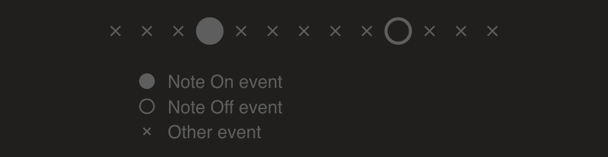
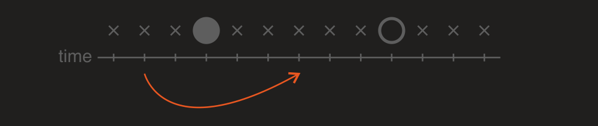
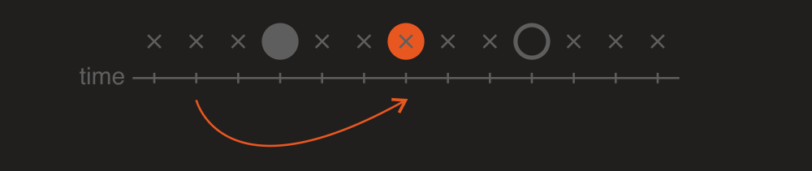
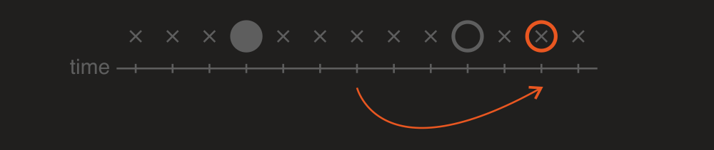
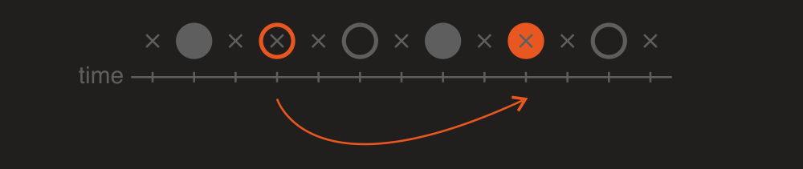
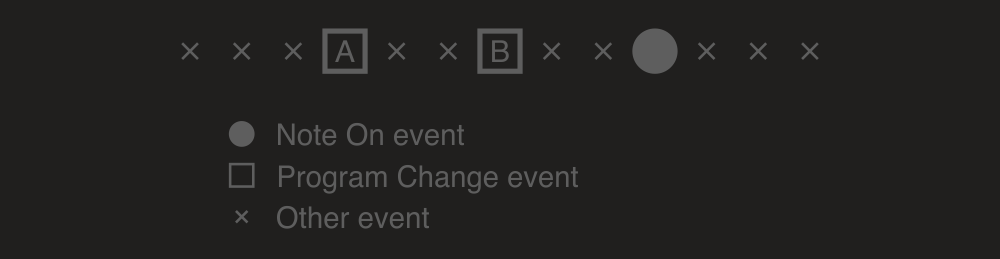
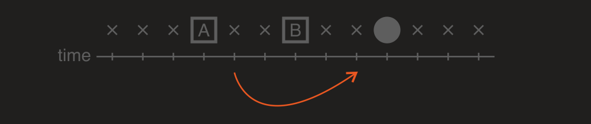
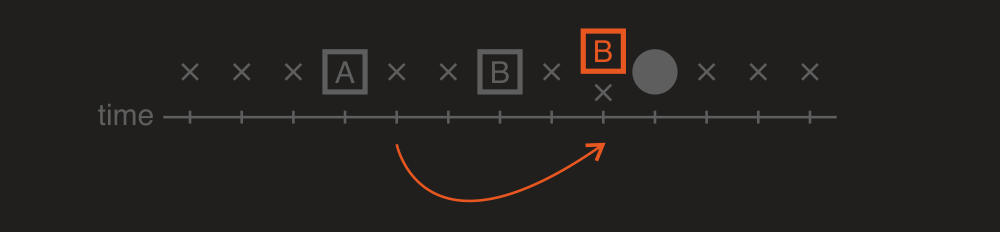
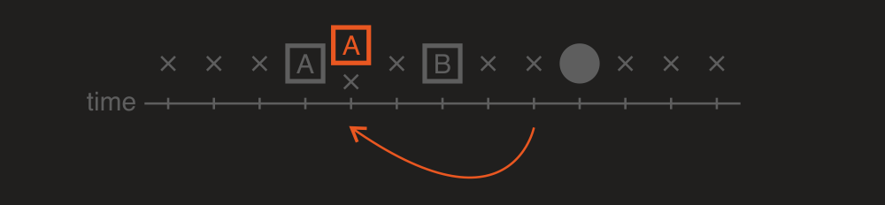

---
uid: a_playback_datatrack
---

# Playback data tracking

[Playback](xref:Melanchall.DryWetMidi.Multimedia.Playback) provides a way to track some MIDI data to correctly handle jumps in time and get properly sounding data. There are two main groups of data to track:

* [notes](#notes-tracking)
* [MIDI parameters](#midi-parameters-values-tracking) (program, pitch bend, control value, channel aftertouch, note aftertouch)

## Notes tracking

Let's take a look at the following events sequence to play:

`Playback` class has [TrackNotes](xref:Melanchall.DryWetMidi.Multimedia.Playback.TrackNotes) property. If its value is `true`, playback will internally construct notes based on input objects to play. So in our example one note will be constructed:

Now let's imagine a playback's time is at some point and we want to jump to a new one (with [MoveToTime](xref:Melanchall.DryWetMidi.Multimedia.Playback.MoveToTime(Melanchall.DryWetMidi.Interaction.ITimeSpan)) for example):

If we now jump to a new time that falls in the middle of the note, the behavior of the playback will be different depending on the `TrackNotes` property value. If the property value is `false`, nothing special will happen; just the current time of the playback will be changed. But if we set `TrackNotes` to `true`, a new _Note On_ event will be generated and played when we jump to the new time:

The same situation with opposite case:

So we want to jump from the middle of a note to the time after the note. As in the previous example, if `TrackNotes` is `false`, just the current time of the playback will be changed. But if it is `true`, a new _Note Off_ event will be generated and played when we jump to the new time.

So `TrackNotes = true` tells playback to track time jumps when the current time pointer of the playback either leaves a note or enters one to finish or start the note correspondingly.

Of course in cases like this:

playback will play both _Note Off_ event (since we're leaving the first note) and _Note On_ one (since we're entering the second note).

## MIDI parameters values tracking

Let's imagine we have the following events sequence to play:

And now we want to jump from the current time of a playback to a new time (with [MoveToTime](xref:Melanchall.DryWetMidi.Multimedia.Playback.MoveToTime(Melanchall.DryWetMidi.Interaction.ITimeSpan)) for example):

So by the current time `A` event is played and the current program corresponds to `A`. If the playback just changes the current time, the note will be played using program `A` which may be wrong since the note is actually under `B` program influence.

To track a program, `Playback` class has the [TrackProgram](xref:Melanchall.DryWetMidi.Multimedia.Playback.TrackProgram) property. If it's set to `false`, nothing will happen except changing the current time. All following notes can sound incorrectly due to possibly skipped program changes.

But if we set `TrackProgram` to `true`, playback will play the required _Program Change_ event immediately after the time is changed. So in our example `B` will be played and then playback continues from the new time:

Program tracking works in opposite direction too of course:

We have program `B` active at the current time. But when we jump to a new time (before `B` but after `A`), `A` event will be played.

`Playback` can currently track five MIDI parameters:

* [program](xref:Melanchall.DryWetMidi.Core.ProgramChangeEvent);
* [pitch bend](xref:Melanchall.DryWetMidi.Core.PitchBendEvent);
* [control value](xref:Melanchall.DryWetMidi.Core.ControlChangeEvent);
* [channel aftertouch](xref:Melanchall.DryWetMidi.Core.ChannelAftertouchEvent);
* [note aftertouch](xref:Melanchall.DryWetMidi.Core.NoteAftertouchEvent).

We have discussed program tracking above. Tracking the other parameters works similarly. Use the [TrackPitchValue](xref:Melanchall.DryWetMidi.Multimedia.Playback.TrackPitchValue) property to track pitch bend values, [TrackControlValue](xref:Melanchall.DryWetMidi.Multimedia.Playback.TrackControlValue) to track control values, [TrackChannelAftertouch](xref:Melanchall.DryWetMidi.Multimedia.Playback.TrackChannelAftertouch) to track channel aftertouch, and [TrackNoteAftertouch](xref:Melanchall.DryWetMidi.Multimedia.Playback.TrackNoteAftertouch) to track note aftertouch.

Program, pitch bend, and channel aftertouch are tracked separately for each MIDI channel. Control values are tracked separately for each MIDI channel and control number, and note aftertouch values are tracked separately for each MIDI channel and note number.