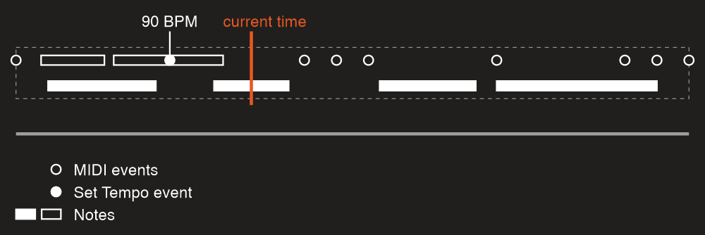
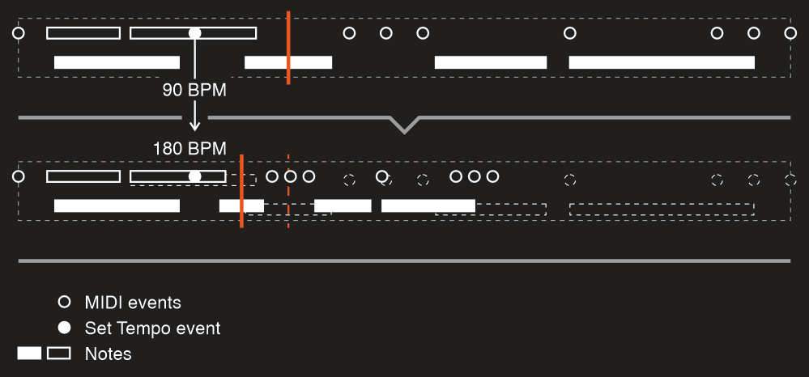

---
uid: a_playback_dynamic
---

# Dynamic changes

Playback API allows you to modify objects during playback. So you can, for example, add or remove a note or chord or any other MIDI event, or change tempo at some point in time. With this feature it’s possible to even build a MIDI sequencer or piano roll like in your favorite DAW.

Following code is a small demonstration of what you can do:

```csharp
using Melanchall.DryWetMidi.Common;
using Melanchall.DryWetMidi.Core;
using Melanchall.DryWetMidi.Interaction;
using Melanchall.DryWetMidi.Multimedia;
using Melanchall.DryWetMidi.MusicTheory;

namespace DynamicPlayback
{
    internal class Program
    {
        private static MusicalTimeSpan NoteLength = MusicalTimeSpan.Quarter;
        private static MusicalTimeSpan GapStepLength = MusicalTimeSpan.ThirtySecond;

        static void Main(string[] args)
        {
            var tempoMap = TempoMap.Default;
            
            var observableCollection = new ObservableTimedObjectsCollection
            {
                new Scale(ScaleIntervals.Major, NoteName.C)
                    .GetAscendingNotes(Octave.Middle.C)
                    .Take(10)
                    .Select((n, i) => new Melanchall.DryWetMidi.Interaction.Note(n.NoteNumber)
                        .SetTime(NoteLength * i, tempoMap)
                        .SetLength(NoteLength, tempoMap))
            };

            var outputDevice = OutputDevice.GetByName("Microsoft GS Wavetable Synth");
            var playback = new Playback(observableCollection, tempoMap, outputDevice);
            playback.Loop = true;

            Console.WriteLine("Press any key to start playback...");
            Console.ReadKey();

            playback.Start();

            Console.WriteLine("Press ↑ or ↓ to change program number");
            Console.WriteLine("Press ← or → to change gap between notes");
            Console.WriteLine("Press any other key to exit...");

            HandleChanges(observableCollection, tempoMap);

            playback.Dispose();
            outputDevice.Dispose();
        }

        private static void HandleChanges(
            ObservableTimedObjectsCollection observableCollection,
            TempoMap tempoMap)
        {
            TimedEvent programChangeTimedEvent = null;

            var currentGapSteps = 0;
            var currentProgram = SevenBitNumber.MinValue;

            while (true)
            {
                var key = Console.ReadKey().Key;

                switch (key)
                {
                    case ConsoleKey.UpArrow:
                    case ConsoleKey.DownArrow:
                        HandleProgramChange(key, ref currentProgram, ref programChangeTimedEvent, observableCollection);
                        break;
                    case ConsoleKey.LeftArrow:
                    case ConsoleKey.RightArrow:
                        HandleGapChange(key, ref currentGapSteps, observableCollection, tempoMap);
                        break;
                    default:
                        return;
                }
            }
        }

        private static void HandleProgramChange(
            ConsoleKey key,
            ref SevenBitNumber program,
            ref TimedEvent programChangeTimedEvent,
            ObservableTimedObjectsCollection observableCollection)
        {
            program = key == ConsoleKey.UpArrow
                ? (SevenBitNumber)Math.Min(SevenBitNumber.MaxValue, program + 1)
                : (SevenBitNumber)Math.Max(SevenBitNumber.MinValue, program - 1);
            
            Console.WriteLine($"New program number: {program}");

            if (programChangeTimedEvent == null)
            {
                programChangeTimedEvent = new TimedEvent(new ProgramChangeEvent(program), 0);
                observableCollection.Add(programChangeTimedEvent);
            }
            else
            {
                var programNumber = program;
                observableCollection.ChangeObject(
                    programChangeTimedEvent,
                    obj => ((ProgramChangeEvent)((TimedEvent)obj).Event).ProgramNumber = programNumber);
            }
        }

        private static void HandleGapChange(
            ConsoleKey key,
            ref int gapSteps,
            ObservableTimedObjectsCollection observableCollection,
            TempoMap tempoMap)
        {
            gapSteps = key == ConsoleKey.LeftArrow
                ? Math.Max(0, gapSteps - 1)
                : gapSteps + 1;
            
            Console.WriteLine($"New gap between notes: {gapSteps}");

            var gapStepsNumber = gapSteps;

            var i = 0;

            foreach (var note in observableCollection.OfType<Melanchall.DryWetMidi.Interaction.Note>())
            {
                observableCollection.ChangeObject(
                    note,
                    _ => note.SetTime((NoteLength + GapStepLength * gapStepsNumber) * i, tempoMap));

                i++;
            }
        }
    }
}
```

What does this console application do? Well, first of all it creates a set of notes (which is 10 steps of major scale starting from _C_) and then starts playing them in a loop. Interesting thing here is we use [ObservableTimedObjectsCollection](xref:Melanchall.DryWetMidi.Interaction.ObservableTimedObjectsCollection) – a collection which allows us to modify those notes on the fly and even add new MIDI data to the current playback object:

* Press the **up** or **down** arrow key and the current program number will be **incremented** or **decremented**, so a new instrument will be used to make sound. To apply a program we need to add a [Program Change](xref:Melanchall.DryWetMidi.Core.ProgramChangeEvent) event. If it already exists, we’ll just modify its [ProgramNumber](xref:Melanchall.DryWetMidi.Core.ProgramChangeEvent.ProgramNumber) property.
* Press the **right** or **left** arrow and the gap between notes will be **incremented** or **decremented**. So we’re modifying notes times here.

## IObservableTimedObjectsCollection

In fact, to enable tracking of data changes you need to create an instance of the [Playback](xref:Melanchall.DryWetMidi.Multimedia.Playback) passing to its constructor an object which type implements two interfaces:

1. `IEnumerable<ITimedObject>` (just because `Playback`’s constructor accepts an argument of this type);
2. [IObservableTimedObjectsCollection](xref:Melanchall.DryWetMidi.Interaction.IObservableTimedObjectsCollection).

When you modify a collection, it will fire the [CollectionChanged](xref:Melanchall.DryWetMidi.Interaction.IObservableTimedObjectsCollection.CollectionChanged) event holding information about what objects were added, removed and changed.

[ObservableTimedObjectsCollection](xref:Melanchall.DryWetMidi.Interaction.ObservableTimedObjectsCollection) is a built-in type that meets two requirements above. It obviously has methods like [Add](xref:Melanchall.DryWetMidi.Interaction.ObservableTimedObjectsCollection.Add*) or [Remove](xref:Melanchall.DryWetMidi.Interaction.ObservableTimedObjectsCollection.Remove*), but also some special ones. First of all, in the example above we use the [ChangeObject](xref:Melanchall.DryWetMidi.Interaction.ObservableTimedObjectsCollection.ChangeObject*) method. It allows you to modify an object and tell the collection that it has been changed in some way.

```csharp
collection.ChangeObject(chord, obj =>
{
    var c = (Chord)obj;
    c.Notes.Remove(c.Notes.First());
});

collection.ChangeObject(chord, _ =>
{
    chord.Channel = (FourBitNumber)5;
});
```
Sometimes your logic of collection modification can be complex and/or distributed between different parts of code. In this case it will be more efficient to fire [CollectionChanged](xref:Melanchall.DryWetMidi.Interaction.IObservableTimedObjectsCollection.CollectionChanged) one time when you’re done with the data instead of triggering the event each time you make a change. There is a method for that – [ChangeCollection](xref:Melanchall.DryWetMidi.Interaction.ObservableTimedObjectsCollection.ChangeCollection*):

```csharp
var tempoMap = TempoMap.Create(Tempo.FromBeatsPerMinute(240));
var collection = new ObservableTimedObjectsCollection();

collection.ChangeCollection(() =>
{
    AddInitialObjects(collection, tempoMap);
    FilterObjects(collection);
    FixObjects(collection, tempoMap);
});

private static void AddInitialObjects(
    ObservableTimedObjectsCollection collection,
    TempoMap tempoMap)
{
    collection.Add(SevenBitNumber
        .Values
        .Select((noteNumber, i) => new Note(noteNumber) { Time = i * 100, Length = 200 }));

    collection.Add(
        new TimedEvent(new ProgramChangeEvent((SevenBitNumber)7) { Channel = (FourBitNumber)4 })
            .SetTime(MusicalTimeSpan.Quarter, tempoMap),
        new Chord(
            new Note((SevenBitNumber)80),
            new Note((SevenBitNumber)90))
        {
            Channel = (FourBitNumber)4
        });
}

private static void FilterObjects(
    ObservableTimedObjectsCollection collection)
{
    var objectsToRemove = collection
        .Where(obj => obj is Note note && note.NoteNumber % 2 == 0)
        .ToList();

    collection.Remove(objectsToRemove);
}

private static void FixObjects(
    ObservableTimedObjectsCollection collection,
    TempoMap tempoMap)
{
    new Quantizer().Quantize(
        collection,
        new SteppedGrid(new MetricTimeSpan(0, 0, 1)),
        tempoMap);
}
```

If you write just

```csharp
AddInitialObjects(collection, tempoMap);
FilterObjects(collection);
FixObjects(collection, tempoMap);
```

it will trigger playback’s logic of data tracking multiple times which will degrade performance (you may notice lags in playback).

Of course you can create your own class implementing `IObservableTimedObjectsCollection` (and `IEnumerable<ITimedObject>`) and pass this collection to `Playback`. As the `ObservableTimedObjectsCollection` described above, your class should fire `CollectionChanged` event which arguments object ([ObservableTimedObjectsCollectionChangedEventArgs](xref:Melanchall.DryWetMidi.Interaction.ObservableTimedObjectsCollectionChangedEventArgs)) contains following data:

* [AddedObjects](xref:Melanchall.DryWetMidi.Interaction.ObservableTimedObjectsCollectionChangedEventArgs.AddedObjects);
* [RemovedObjects](xref:Melanchall.DryWetMidi.Interaction.ObservableTimedObjectsCollectionChangedEventArgs.RemovedObjects);
* [ChangedObjects](xref:Melanchall.DryWetMidi.Interaction.ObservableTimedObjectsCollectionChangedEventArgs.ChangedObjects).

First and second properties provide a collection of [ITimedObject](xref:Melanchall.DryWetMidi.Interaction.ITimedObject) objects which have been added and removed. Third property contains instances of the [ChangedTimedObject](xref:Melanchall.DryWetMidi.Interaction.ChangedTimedObject) holding an object along with its old time (time before changing).

## Objects references

Note that you must use original objects references when you’re working with an observable collection. For example, with this code

```csharp
var collection = new ObservableTimedObjectsCollection
{
    new TimedEvent(new TextEvent("A"), 100)
};

var removed = collection.Remove(new TimedEvent(new TextEvent("A"), 100));
```

`removed` variable will have `false` value since we’re passing a new reference to the `Remove` method. Proper way is

```csharp
var timedEvent = new TimedEvent(new TextEvent("A"), 100);
var collection = new ObservableTimedObjectsCollection
{
    timedEvent
};

var removed = collection.Remove(timedEvent);
```

or

```csharp
var collection = new ObservableTimedObjectsCollection
{
    new TimedEvent(new TextEvent("A"), 100)
};

var removed = collection.Remove(collection.First());
```

The same situation with the `ChangeObject` method.

## Orphaned Note On and Note Off events

Also we need to discuss a case when you add a [Note On](xref:Melanchall.DryWetMidi.Core.NoteOnEvent) or [Note Off](xref:Melanchall.DryWetMidi.Core.NoteOffEvent) event instead of a Note object. If you add a _Note On_ event, no note will be built internally until you add corresponding (with the same note number and channel) _Note Off_ event. The same is true if you add a _Note Off_ event – you need to add corresponding _Note On_ one to get the note and to have it played.

So with this code

```csharp
collection.Add(new TimedEvent(
    new NoteOnEvent((SevenBitNumber)70, SevenBitNumber.MaxValue),
    100));
```

you won’t hear the note until

```csharp
collection.Add(new TimedEvent(
    new NoteOffEvent((SevenBitNumber)70, SevenBitNumber.MinValue),
    200));
```

## Tempo map

Obviously you can add a new [Set Tempo](xref:Melanchall.DryWetMidi.Core.SetTempoEvent) event or modify an existing one. But what happens within playback when you do that?

First of all, the process of scaling events times begins. So it can take some time to process events after a tempo change. Of course, only data **after** a tempo change will be scaled.

For example, if we have this initial collection

```csharp
var collection = new ObservableTimedObjectsCollection
{
    new Note((SevenBitNumber)90) { Time = 300, Length = 500 },
};
```

and default tempo map (`500000` microseconds per quarter note or `120` BPM), then playback events are:

* _Note On_ at `300` ticks;
* _Note Off_ at `800` ticks.

Now we want to add a _Set Tempo_ event:

```csharp
collection.Add(new TimedEvent(new SetTempoEvent(250000), 100));
```

This change makes tempo 2x faster and playback events will be:

* _Set Tempo_ at `100` ticks;
* _Note On_ at `200` ticks;
* _Note Off_ at `450` ticks.

So time spans between the tempo change and events become 2x shorter (so they will be played earlier making playback faster).

It's important to note that when you change the tempo map, some time-based things other than MIDI events within the playback will be scaled too. To explain this better, let's take a look at the current time of the playback which can be accessed via [GetCurrentTime](xref:Melanchall.DryWetMidi.Multimedia.Playback.GetCurrentTime*) methods. For example, we have such a playback state:



If we change the _Set Tempo_ event so that the tempo will be 180 BPM (instead of current 90 BPM), the data will be shrinked by two times:



As you can see, the current time has been scaled too. Initially it was at the middle of the note. Scaling of the current time ensures it remains at the middle of that note so the playback will be smooth and without unexpected time jumps.

To preserve relative positions, following properties will be scaled too:

* [PlaybackStart](xref:Melanchall.DryWetMidi.Multimedia.Playback.PlaybackStart);
* [PlaybackEnd](xref:Melanchall.DryWetMidi.Multimedia.Playback.PlaybackEnd);
* times of snap points.

When you use `Playback` created with an observable collection, you should use [TempoMap](xref:Melanchall.DryWetMidi.Multimedia.Playback.TempoMap) property of the `Playback` instance when you work with its objects. When you edit a tempo map (via adding, removing or changing _Set Tempo_ and _Time Signature_ events), this property will reflect these changes. So the property holds the actual [tempo map](xref:a_tempo_map) of the playback:

```csharp
collection.Add(new TimedEvent(new TextEvent("A"))
    .SetTime(new MetricTimeSpan(0, 0, 1), playback.TempoMap));
```