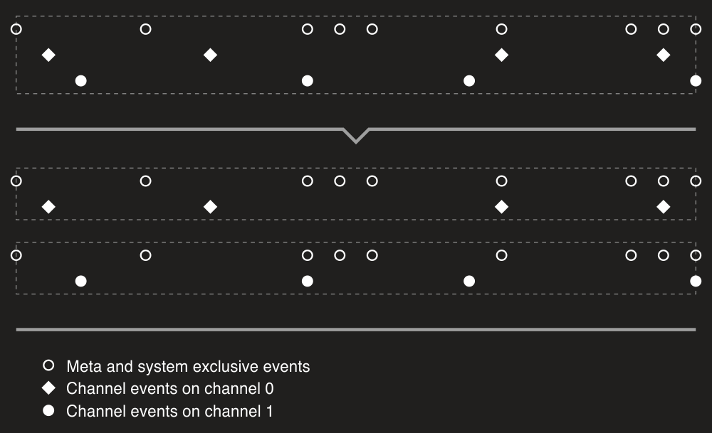
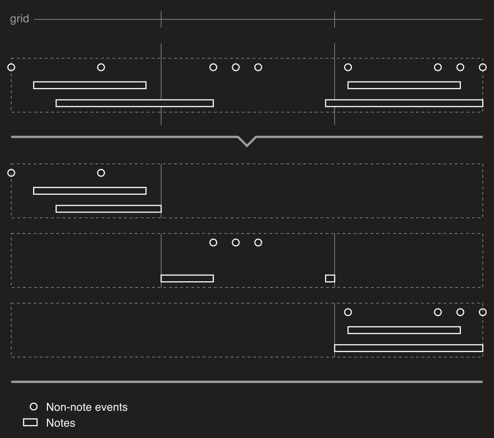
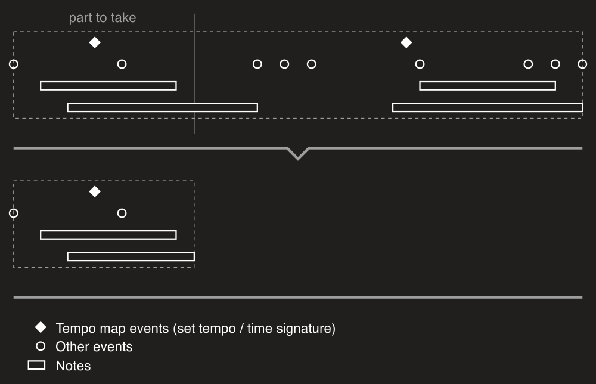
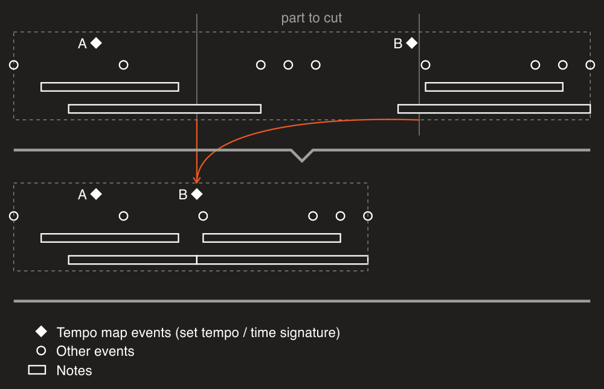

---
uid: a_file_splitting
---

# MIDI file splitting

You can split a MIDI file in different ways using extension methods from the [Splitter](xref:Melanchall.DryWetMidi.Tools.Splitter) class. Available methods are described below. Please note that the article doesn't cover all possible methods and their settings. Please read API documentation on [Splitter](xref:Melanchall.DryWetMidi.Tools.Splitter) to get complete information.

## SplitByChannel

[SplitByChannel](xref:Melanchall.DryWetMidi.Tools.Splitter.SplitByChannel*) method splits a MIDI file by channel so all [channel events](xref:Melanchall.DryWetMidi.Core.ChannelEvent) will be separated by channel and copied to corresponding new files. All meta and system exclusive events will be copied to all the new files (that's default behavior that can be turned off). Thus each new file will contain all meta and sysex events and channel ones for a single channel. The image below illustrates this process:



## SplitByObjects

[SplitByObjects](xref:Melanchall.DryWetMidi.Tools.Splitter.SplitByObjects*) method splits a MIDI file by objects. The process can be adjusted via [SplitByObjectsSettings](xref:Melanchall.DryWetMidi.Tools.SplitByObjectsSettings) passed to the second parameter of the method.

For example, to split a file by notes copying all MIDI events to each new file:

```csharp
var newFiles = midiFile.SplitByObjects(
    ObjectType.Note | ObjectType.TimedEvent,
    new SplitByObjectsSettings
    {
        WriteToAllFilesPredicate = obj => obj is TimedEvent
    });
```

Here we specify that we need to split the file by notes and timed events, but every timed event must be written to all result files. So in fact we're splitting the file by notes having all non-notes timed events presented in each new file. The image below illustrates the process:


To split a file by objects the tool needs to determine the key of each object. Objects with the same key will be outputted in a separate file. In the example above default logic of key calculation is used. The following table shows what a default key is for each type of an object:

|Object type|Key|
|-----------|---|
|[TimedEvent](xref:Melanchall.DryWetMidi.Interaction.ObjectType.TimedEvent)|The type of the underlying event ([EventType](xref:Melanchall.DryWetMidi.Core.MidiEvent.EventType) of [TimedEvent.Event](xref:Melanchall.DryWetMidi.Interaction.TimedEvent.Event)).|
|[Note](xref:Melanchall.DryWetMidi.Interaction.ObjectType.Note)|Pair of the [channel](xref:Melanchall.DryWetMidi.Interaction.Note.Channel) and [note number](xref:Melanchall.DryWetMidi.Interaction.Note.NoteNumber) of a note.|
|[Chord](xref:Melanchall.DryWetMidi.Interaction.ObjectType.Chord)|Collection of keys of the underlying [notes](xref:Melanchall.DryWetMidi.Interaction.Chord.Notes).|

You can alter key calculation logic by providing custom key selector. For example, to separate notes by only note number ignoring a note's channel:

```csharp
var newFiles = midiFile.SplitByObjects(
    ObjectType.Note | ObjectType.TimedEvent,
    new SplitByObjectsSettings
    {
        KeySelector = obj => (obj as Note)?.NoteNumber,
        WriteToAllFilesPredicate = obj => obj is TimedEvent
    });
```

Here a key will be resolved to `null` if an object is not an instance of the `Note`. `null` key means to use the default key calculation logic shown above.

If key selection is complex, you may decide to implement a class for such a key. Just for example, let's create the key class that identifies a chord by its shortest name:

```csharp
private sealed class ChordNameId
{
    private readonly string _name;
    
    public ChordNameId(Chord chord)
    {
        _name = chord.GetMusicTheoryChord().GetNames().FirstOrDefault();
    }

    public override bool Equals(object obj) =>
        obj is ChordNameId chordNameId &&
        chordNameId._name == _name;

    public override int GetHashCode() =>
        _name.GetHashCode();
}
```

And now we can use it to split a file by chords of the same name:

```csharp
var newFiles = midiFile.SplitByObjects(
    ObjectType.Chord,
    new SplitByObjectsSettings
    {
        KeySelector = obj => new ChordNameId((Chord)obj)
    });
```

Please see documentation on [SplitByObjectsSettings](xref:Melanchall.DryWetMidi.Tools.SplitByObjectsSettings) to learn more about how you can adjust the process of splitting.

## SplitByGrid

[SplitByGrid](xref:Melanchall.DryWetMidi.Tools.Splitter.SplitByGrid*) method splits a MIDI file by the specified grid. Each file will preserve the original tempo map and all parameters changes (like a control value or program changes). The image below shows general case of splitting a MIDI file by grid:


Splitting can be adjusted via the `settings` parameter of the [SliceMidiFileSettings](xref:Melanchall.DryWetMidi.Tools.SliceMidiFileSettings) type. [SplitNotes](xref:Melanchall.DryWetMidi.Tools.SliceMidiFileSettings.SplitNotes) and [PreserveTimes](xref:Melanchall.DryWetMidi.Tools.SliceMidiFileSettings.PreserveTimes) properties described below. Please see all available properties in documentation for [SliceMidiFileSettings](xref:Melanchall.DryWetMidi.Tools.SliceMidiFileSettings).

### SplitNotes

[SplitNotes](xref:Melanchall.DryWetMidi.Tools.SliceMidiFileSettings.SplitNotes) indicates whether notes should be split at points of grid intersection or not. The default value is `true`. If `false` used, notes treated as just Note On / Note Off events rather than note objects. Splitting notes produces new Note On / Note Off events at points where grid intersects notes if the property set to `true`. The following image shows splitting by grid if `SplitNotes` set to `false`:


### PreserveTimes

[PreserveTimes](xref:Melanchall.DryWetMidi.Tools.SliceMidiFileSettings.PreserveTimes) indicates whether original times of events should be preserved or not. The default value is `false`. If `false` used, events will be moved to the start of a new file. If `true` used, events will be placed in new files at the same times as in the input file. The following image shows splitting in case of `PreserveTimes` set to `true`:



## SkipPart

[SkipPart](xref:Melanchall.DryWetMidi.Tools.Splitter.SkipPart*) method skips part of the specified length of a MIDI file and returns the remaining part as an instance of [MidiFile](xref:Melanchall.DryWetMidi.Core.MidiFile). The image below shows general case of skipping a part of a MIDI file:


## TakePart

[TakePart](xref:Melanchall.DryWetMidi.Tools.Splitter.TakePart*) methods take part of the specified length of a MIDI file (starting at the start or at the specified time within the file) and return it as an instance of [MidiFile](xref:Melanchall.DryWetMidi.Core.MidiFile). The image below shows both cases of taking a part of a MIDI file:




## CutPart

[CutPart](xref:Melanchall.DryWetMidi.Tools.Splitter.CutPart*) method cuts a part of the specified length from a MIDI file (starting at the specified time within the file) and returns a new instance of [MidiFile](xref:Melanchall.DryWetMidi.Core.MidiFile) which is the original file without the part. The image below shows how the method works:

