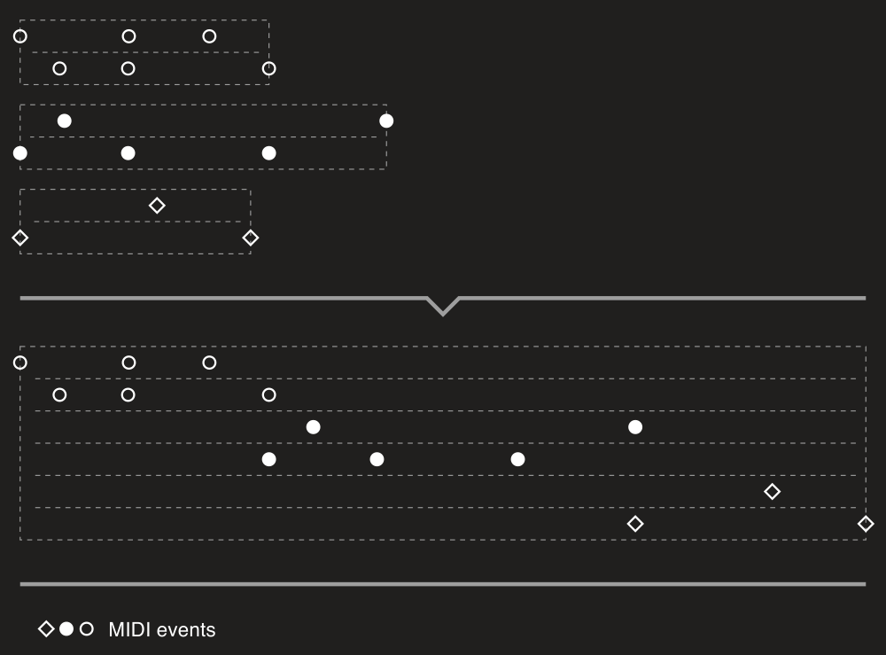
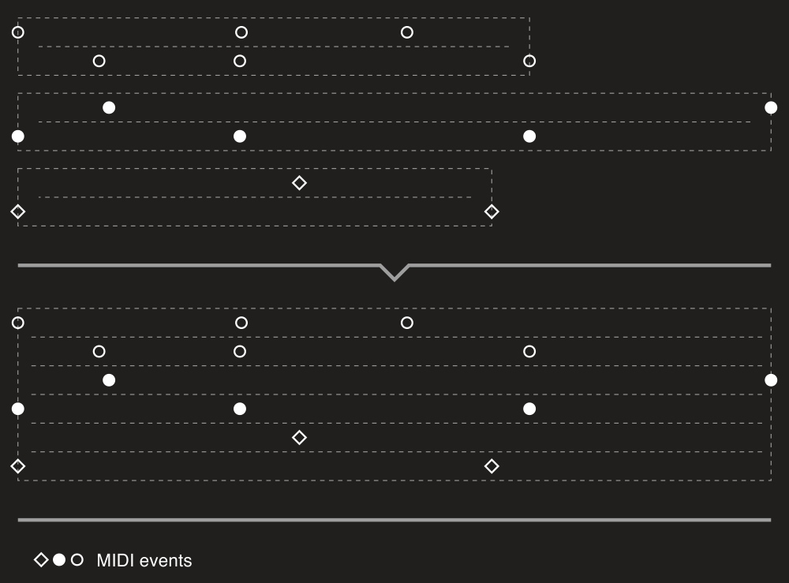

---
uid: a_files_merging
---

# MIDI files merging

[Merger](xref:Melanchall.DryWetMidi.Tools.Merger) provides two ways of merging MIDI files:

* **sequentially** – placing files one after other;
* **simultaneously** – placing files "one below other".

Both routines are extension methods for `IEnumerable<MidiFile>`. Please see sections below to learn more about each method.

## MergeSequentially

Image below shows a quick overview of what you'll get with the [MergeSequentially](xref:Melanchall.DryWetMidi.Tools.Merger.MergeSequentially*) method:



Here we're merging three files each of two track chunks. So as you can see events of the second file are placed right after last event of the first file, and events of the third file are placed directly after last event of the second one. In the code it looks like that:

```csharp
midiFiles.MergeSequentially();
```

There is one important note about how merging works. Obviously files can have different time divisions. If shortly, a MIDI tick (single unit of time) can have different length in milliseconds. Just placing files one after other and using time division of the first file, for example, we'll ruine timings of MIDI events of the files are merged.

To preserve correct timings of all MIDI events of all input files in the result one [MergeSequentially](xref:Melanchall.DryWetMidi.Tools.Merger.MergeSequentially*) does following steps:

1. calculates new time division as the least common multiple of TPQNs ([ticks per quarter note](xref:Melanchall.DryWetMidi.Core.TicksPerQuarterNoteTimeDivision)) of the input files;
2. for each input file calculates a scale factor every delta-time in the file should be multiplied by;
3. writes MIDI events in the result file using the new time division and scaled delta-times.

If you want to add some spacing between files, you can set its length using [SequentialMergingSettings](xref:Melanchall.DryWetMidi.Tools.SequentialMergingSettings) and the [DelayBetweenFiles](xref:Melanchall.DryWetMidi.Tools.SequentialMergingSettings.DelayBetweenFiles) property:

```csharp
midiFiles.MergeSequentially(new SequentialMergingSettings
{
    DelayBetweenFiles = MusicalTimeSpan.Quarter
});
```


We may want also to align starts of the input files to a grid. It would be better to describe the task with an example:

```csharp
var midiFile = new PatternBuilder()
    .SetNoteLength(MusicalTimeSpan.Quarter)
    .StepForward(MusicalTimeSpan.Half)
    .Note("A4")
    .Build()
    .ToFile(TempoMap.Default);
```

Here we have the file with a single A4 note of quarter length. The note starts at 1/2. So we have a space (`S`) of quarter length from the end of the note (`N`) to the end of a bar:

```text
0    4/4
|----|
|  AS|
```

And now we want to merge this file with another one starting the second file at the bar line. For this purpose there is the [FileDurationRoundingStep](xref:Melanchall.DryWetMidi.Tools.SequentialMergingSettings.FileDurationRoundingStep) property:

```csharp
midiFiles.MergeSequentially(new SequentialMergingSettings
{
    FileDurationRoundingStep = new BarBeatTicksTimeSpan(1)
});
```

Here we state that duartion of each file should be [rounded up](xref:Melanchall.DryWetMidi.Interaction.TimeSpanRoundingPolicy.RoundUp) to 1 bar and then a next file can be placed:


If both [DelayBetweenFiles](xref:Melanchall.DryWetMidi.Tools.SequentialMergingSettings.DelayBetweenFiles) and [FileDurationRoundingStep](xref:Melanchall.DryWetMidi.Tools.SequentialMergingSettings.FileDurationRoundingStep) are set, the method will first round duration and then add a delay.

In all previous examples you can see that a result file has number of track chunks that is the sum of all input files' track chunks numbers. So a track chunk of an input MIDI file will be written to a separate track chunk in a result MIDI file. We can change this default behavior setting [ResultTrackChunksCreationPolicy](xref:Melanchall.DryWetMidi.Tools.SequentialMergingSettings.ResultTrackChunksCreationPolicy) to the [ResultTrackChunksCreationPolicy](xref:Melanchall.DryWetMidi.Tools.ResultTrackChunksCreationPolicy.MinimizeCount) value:

```csharp
midiFiles.MergeSequentially(new SequentialMergingSettings
{
    ResultTrackChunksCreationPolicy = ResultTrackChunksCreationPolicy.MinimizeCount
});
```


## MergeSimultaneously

Image below shows a quick overview of how the [MergeSimultaneously](xref:Melanchall.DryWetMidi.Tools.Merger.MergeSimultaneously*) method works:



So with this code:

```csharp
midiFiles.MergeSimultaneously();
```

track chunks of all input files will be "stacked" in the result MIDI file.

This method uses the same logic to preserve timings of the input files as the [MergeSequentially](#mergesequentially) one. But [MergeSimultaneously](xref:Melanchall.DryWetMidi.Tools.Merger.MergeSimultaneously*) has a limitation by default: tempo maps of all input files after this logic applied must be equal. It means that all files must have the same tempo changes and time signature changes and at the same times. You can turn off this check with the [IgnoreDifferentTempoMaps](xref:Melanchall.DryWetMidi.Tools.SimultaneousMergingSettings.IgnoreDifferentTempoMaps) property set to `true`:

```csharp
midiFiles.MergeSimultaneously(new SimultaneousMergingSettings
{
    IgnoreDifferentTempoMaps = true
});
```