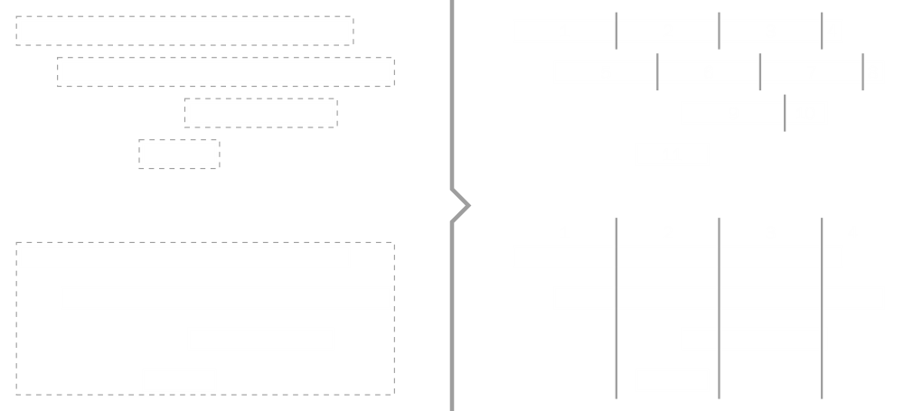
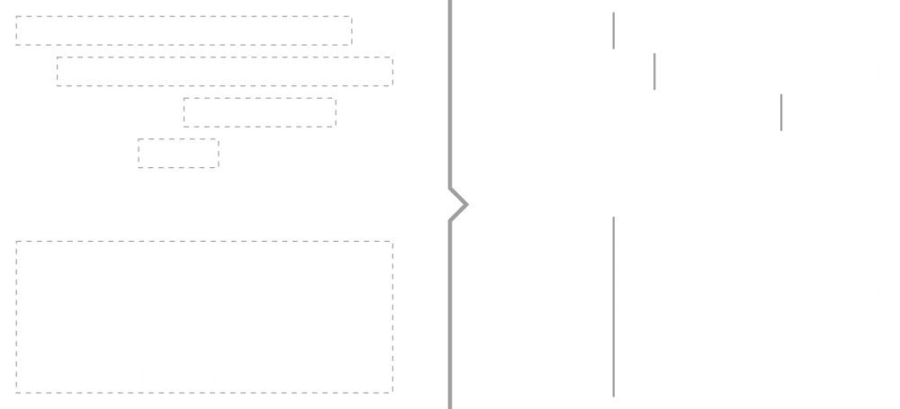

# Notes and chords splitters

With DryWetMIDI notes or chords can be easily splitted using following classes:

* [NotesSplitter](xref:Melanchall.DryWetMidi.Tools.NotesSplitter)
* [ChordsSplitter](xref:Melanchall.DryWetMidi.Tools.ChordsSplitter)

Both classes provide the same set of methods giving you different ways objects can be splitted:
* [SplitByStep](xref:Melanchall.DryWetMidi.Tools.LengthedObjectsSplitter`1.SplitByStep(System.Collections.Generic.IEnumerable{`0},Melanchall.DryWetMidi.Interaction.ITimeSpan,Melanchall.DryWetMidi.Interaction.TempoMap))
* [SplitByPartsNumber](xref:Melanchall.DryWetMidi.Tools.LengthedObjectsSplitter`1.SplitByPartsNumber(System.Collections.Generic.IEnumerable{`0},System.Int32,Melanchall.DryWetMidi.Interaction.TimeSpanType,Melanchall.DryWetMidi.Interaction.TempoMap))
* [SplitByGrid](xref:Melanchall.DryWetMidi.Tools.LengthedObjectsSplitter`1.SplitByGrid(System.Collections.Generic.IEnumerable{`0},Melanchall.DryWetMidi.Interaction.IGrid,Melanchall.DryWetMidi.Interaction.TempoMap))
* [SplitAtDistance by distance](xref:Melanchall.DryWetMidi.Tools.LengthedObjectsSplitter`1.SplitAtDistance(System.Collections.Generic.IEnumerable{`0},Melanchall.DryWetMidi.Interaction.ITimeSpan,Melanchall.DryWetMidi.Tools.LengthedObjectTarget,Melanchall.DryWetMidi.Interaction.TempoMap))
* [SplitAtDistance by ratio](xref:Melanchall.DryWetMidi.Tools.LengthedObjectsSplitter`1.SplitAtDistance(System.Collections.Generic.IEnumerable{`0},System.Double,Melanchall.DryWetMidi.Interaction.TimeSpanType,Melanchall.DryWetMidi.Tools.LengthedObjectTarget,Melanchall.DryWetMidi.Interaction.TempoMap))

Each method takes collection of objects and returns objects of the same type that are result of splitting the input ones. These methods are discussed in details below. Also there are useful methods in [NotesSplitterUtilities](xref:Melanchall.DryWetMidi.Tools.NotesSplitterUtilities) and [ChordsSplitterUtilities](xref:Melanchall.DryWetMidi.Tools.ChordsSplitterUtilities) classes which allow to split objects inside [TrackChunk](xref:Melanchall.DryWetMidi.Core.TrackChunk) or [MidiFile](xref:Melanchall.DryWetMidi.Core.MidiFile) without necessity to work with collection of notes or chords directly.

## SplitByStep

[SplitByStep](xref:Melanchall.DryWetMidi.Tools.LengthedObjectsSplitter`1.SplitByStep(System.Collections.Generic.IEnumerable{`0},Melanchall.DryWetMidi.Interaction.ITimeSpan,Melanchall.DryWetMidi.Interaction.TempoMap)) method splits each object by the specified step starting at the start of an object. For example, if step is 1 second, an object will be splitted at 1 second from its start, at 1 second from previous point of splitting (2 seconds from the object's start), at 1 second from previous point of splitting (3 seconds from the object's start) and so on. If an object's length is less than the specified step, the object will not be splitted and copy of it will be returned. The image below illustrates splitting notes and chord by the same step:

## SplitByPartsNumber

[SplitByPartsNumber](xref:Melanchall.DryWetMidi.Tools.LengthedObjectsSplitter`1.SplitByPartsNumber(System.Collections.Generic.IEnumerable{`0},System.Int32,Melanchall.DryWetMidi.Interaction.TimeSpanType,Melanchall.DryWetMidi.Interaction.TempoMap)) method splits each object into the specified number of parts of equal length. It is necessary to specify the `lengthType` argument to meet your expectations. For example, with metric type each part of an input object will last the same number of microseconds, while with musical type each part's length will represent the same fraction of the whole note's length. But the length of parts can be different in terms of MIDI ticks using different length type depending on tempo map passed to the method. The image below illustrates splitting notes and chord into 4 parts:

## SplitByGrid

[SplitByGrid](xref:Melanchall.DryWetMidi.Tools.LengthedObjectsSplitter`1.SplitByGrid(System.Collections.Generic.IEnumerable{`0},Melanchall.DryWetMidi.Interaction.IGrid,Melanchall.DryWetMidi.Interaction.TempoMap)) method splits each object by the specified grid. Objects will be splitted in points of crossing the specified grid.

The image below illustrates splitting notes and chord by the same grid:

## SplitAtDistance

[SplitAtDistance(objects, distance, from, tempoMap)](xref:Melanchall.DryWetMidi.Tools.LengthedObjectsSplitter`1.SplitAtDistance(System.Collections.Generic.IEnumerable{`0},Melanchall.DryWetMidi.Interaction.ITimeSpan,Melanchall.DryWetMidi.Tools.LengthedObjectTarget,Melanchall.DryWetMidi.Interaction.TempoMap)) and [SplitAtDistance(objects, ratio, lengthType, from, tempoMap)](xref:Melanchall.DryWetMidi.Tools.LengthedObjectsSplitter`1.SplitAtDistance(System.Collections.Generic.IEnumerable{`0},System.Double,Melanchall.DryWetMidi.Interaction.TimeSpanType,Melanchall.DryWetMidi.Tools.LengthedObjectTarget,Melanchall.DryWetMidi.Interaction.TempoMap)) methods split each object at the specified distance or by the specified ratio from start or end of an object (which is defined by `from` parameter). It is necessary to specify the `lengthType` argument for splitting by ratio to meet your expectations. The image below illustrates splitting notes and chord at the same distance from the start of an object:

Next image illustrates splitting notes and chord by the same ratio (`0.25`) from the end of an object:

## Note.Split and Chord.Split

Note or chord can also be splitted by the specified time into two parts without using [NotesSplitter](xref:Melanchall.DryWetMidi.Tools.NotesSplitter) and [ChordsSplitter](xref:Melanchall.DryWetMidi.Tools.ChordsSplitter). [Note](xref:Melanchall.DryWetMidi.Interaction.Note) class has the [Split](xref:Melanchall.DryWetMidi.Interaction.Note.Split(System.Int64)) method, and [Chord](xref:Melanchall.DryWetMidi.MusicTheory.Chord) class has the [Split](xref:Melanchall.DryWetMidi.Interaction.Chord.Split(System.Int64)) method. Both methods returns [SplittedLengthedObject<TObject>](xref:Melanchall.DryWetMidi.Interaction.SplittedLengthedObject`1) where `TObject` is `Note` or `Chord` correspondingly.

`SplittedLengthedObject<TObject>` holds left and right parts of the object was splitted. If value passed to `time` parameter of `Split` method is less than start time of an object, the left part will be `null`. If `time` is greater than end time of an object, the right part will be `null`.