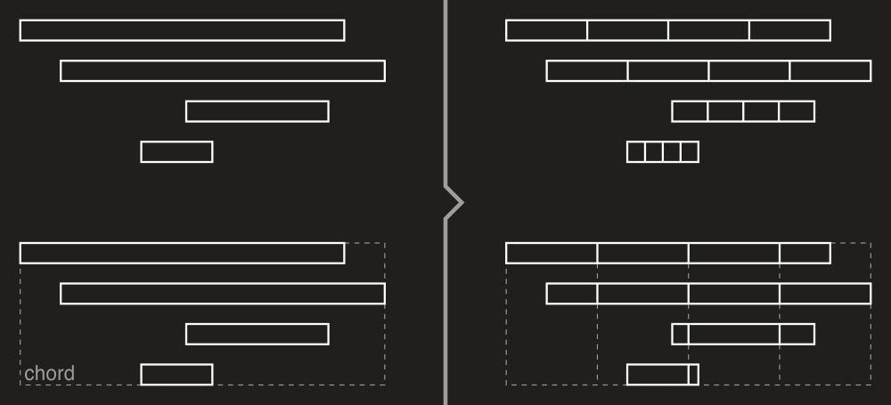
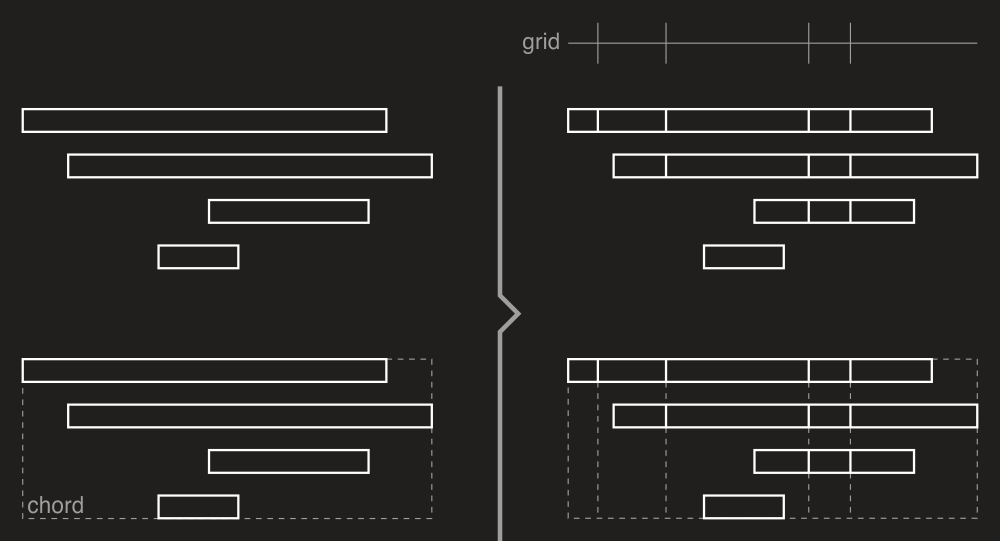
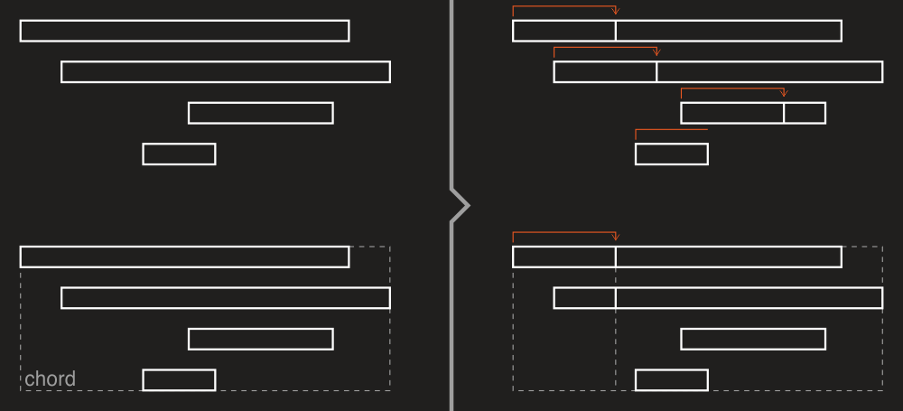
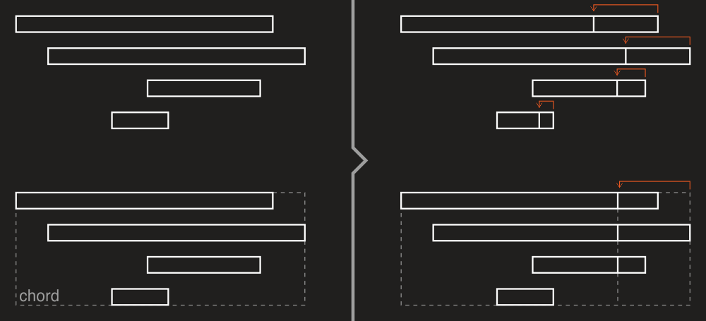

# Objects splitting

With DryWetMIDI you can use methods of the [Splitter](xref:Melanchall.DryWetMidi.Tools.Splitter) class to split objects:

* [SplitObjectsByStep](xref:Melanchall.DryWetMidi.Tools.Splitter.SplitObjectsByStep*)
* [SplitObjectsByPartsNumber](xref:Melanchall.DryWetMidi.Tools.Splitter.SplitObjectsByPartsNumber*)
* [SplitObjectsByGrid](xref:Melanchall.DryWetMidi.Tools.Splitter.SplitObjectsByGrid*)
* [SplitObjectsAtDistance](xref:Melanchall.DryWetMidi.Tools.Splitter.SplitObjectsAtDistance*)

Each method takes collection of [timed objects](xref:Melanchall.DryWetMidi.Interaction.ITimedObject) or MIDI containers (like [file](xref:Melanchall.DryWetMidi.Core.MidiFile) or [track chunk](xref:Melanchall.DryWetMidi.Core.TrackChunk)) and splits objects within by the specified strategy. These methods are discussed in details below.

Also please note that every class that implements [ILengthedObject](xref:Melanchall.DryWetMidi.Interaction.ILengthedObject) has [Split](xref:Melanchall.DryWetMidi.Interaction.ILengthedObject.Split*) method allowing to split an object at the specified time.

## SplitObjectsByStep

[SplitObjectsByStep](xref:Melanchall.DryWetMidi.Tools.Splitter.SplitObjectsByStep*) methods split each object by the specified step starting at the start of an object. For example, if step is `1` second, an object will be split at `1` second from its start, at `1` second from previous point of splitting (`2` seconds from the object's start), at `1` second from previous point of splitting (`3` seconds from the object's start) and so on. If an object's length is less than the specified step, the object will not be split and copy of it will be returned.

The image below illustrates splitting notes and chord by the same step:

## SplitObjectsByPartsNumber

[SplitObjectsByPartsNumber](xref:Melanchall.DryWetMidi.Tools.Splitter.SplitObjectsByPartsNumber*) methods split each object into the specified number of parts of equal length. It is necessary to specify the `lengthType` argument to meet your expectations. For example, with metric type each part of an input object will last the same number of microseconds, while with musical type each part's length will represent the same fraction of the whole note's length. But the length of parts can be different in terms of MIDI ticks using different length type depending on tempo map passed to the method.

The image below illustrates splitting notes and chord into `4` parts:

## SplitObjectsByGrid

[SplitObjectsByGrid](xref:Melanchall.DryWetMidi.Tools.Splitter.SplitObjectsByGrid*) methods split each object by the specified grid. Objects will be split at points of crossing the grid.

The image below illustrates splitting notes and chord by the same grid:

## SplitObjectsAtDistance

[SplitObjectsAtDistance](xref:Melanchall.DryWetMidi.Tools.Splitter.SplitObjectsAtDistance*) methods split each object at the specified distance or by the specified ratio from start or end of an object (which is defined by `from` parameter). It is necessary to specify the `lengthType` argument for splitting by ratio to meet your expectations.

The image below illustrates splitting notes and chord at the same distance from the start of an object:

Next image illustrates splitting notes and chord by the ration of `0.25` from the end of an object:

