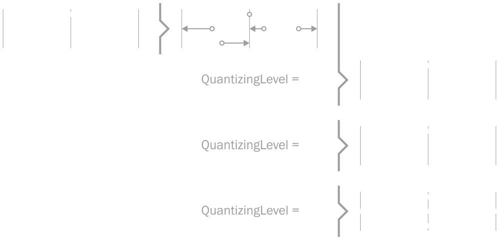
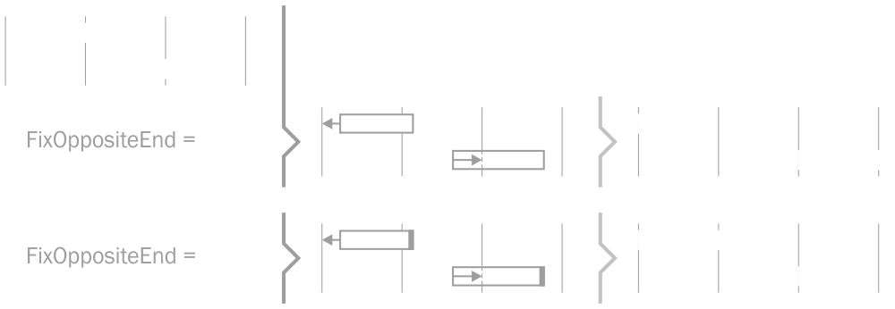
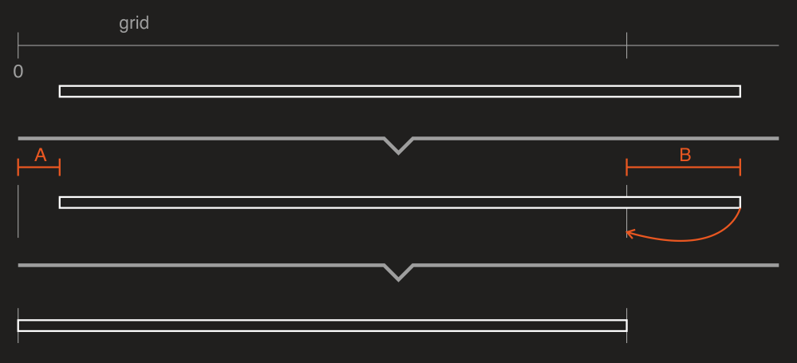
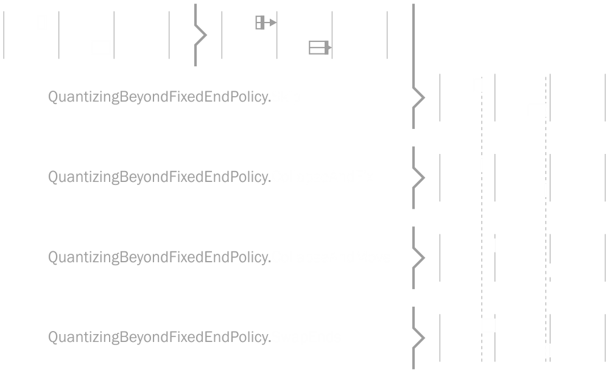
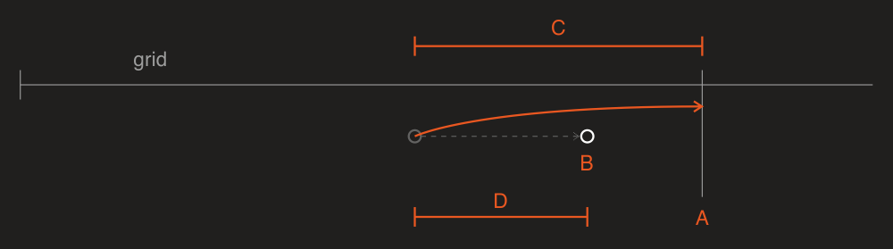

# Quantizer

DryWetMIDI provides tools to perform quantizing of timed events, notes and chords by the specified grid. The classes aimed to solve this task are:

* [TimedEventsQuantizer](xref:Melanchall.DryWetMidi.Tools.TimedEventsQuantizer)
* [NotesQuantizer](xref:Melanchall.DryWetMidi.Tools.NotesQuantizer)
* [ChordsQuantizer](xref:Melanchall.DryWetMidi.Tools.ChordsQuantizer)

Sections below describe usage of them in details.

Grid is passed to the `Quantize` method of those classes as [IGrid](xref:Melanchall.DryWetMidi.Interaction.IGrid) interface.

Note that quantizing routine modifies passed objects instead of returning new ones with quantized times. So be sure you've cloned input objects if you want to save them. [TimedEvent](xref:Melanchall.DryWetMidi.Interaction.TimedEvent), [Note](xref:Melanchall.DryWetMidi.Interaction.Note) and [Chord](xref:Melanchall.DryWetMidi.Interaction.Chord) classes have `Clone` method you can use for that purpose.

Also there are [TimedEventsQuantizerUtilities](xref:Melanchall.DryWetMidi.Tools.TimedEventsQuantizerUtilities), [NotesQuantizerUtilities](xref:Melanchall.DryWetMidi.Tools.NotesQuantizerUtilities) and [ChordsQuantizerUtilities](xref:Melanchall.DryWetMidi.Tools.ChordsQuantizerUtilities) classes that contain useful methods to quantize objects inside [TrackChunk](xref:Melanchall.DryWetMidi.Core.TrackChunk) and [MidiFile](xref:Melanchall.DryWetMidi.Core.MidiFile) without necessity to work with collection of timed events, notes or chords directly.

## Quantizing timed events

Timed events can be quantized with [Quantize](xref:Melanchall.DryWetMidi.Tools.TimedEventsQuantizer.Quantize(System.Collections.Generic.IEnumerable{Melanchall.DryWetMidi.Interaction.TimedEvent},Melanchall.DryWetMidi.Interaction.IGrid,Melanchall.DryWetMidi.Interaction.TempoMap,Melanchall.DryWetMidi.Tools.TimedEventsQuantizingSettings)) method of the [TimedEventsQuantizer](xref:Melanchall.DryWetMidi.Tools.TimedEventsQuantizer) class. The image below illustrates quantizing of timed events:

The following image shows _groove quantizing_. Grid's times will be distributed according to the provided steps. So distance between first pair of adjacent times will be equal to first step, distance between second pair of adjacent times will be equal to second step and so on. When last step reached, steps will go from the first one.

Please read documentation for [TimedEventsQuantizingSettings](xref:Melanchall.DryWetMidi.Tools.TimedEventsQuantizingSettings) to see available settings. Image below shows quantizing with different values of [QuantizingLevel](xref:Melanchall.DryWetMidi.Tools.QuantizingSettings`1.QuantizingLevel):

## Quantizing notes and chords

For quantizing notes and chords there are [NotesQuantizer](xref:Melanchall.DryWetMidi.Tools.NotesQuantizer) and [ChordsQuantizer](xref:Melanchall.DryWetMidi.Tools.ChordsQuantizer) classes respectively. Both classes provide [Quantize](xref:Melanchall.DryWetMidi.Tools.LengthedObjectsQuantizer`2.Quantize(System.Collections.Generic.IEnumerable{`0},Melanchall.DryWetMidi.Interaction.IGrid,Melanchall.DryWetMidi.Interaction.TempoMap,`1)) method.

[Note](xref:Melanchall.DryWetMidi.Interaction.Note) and [Chord](xref:Melanchall.DryWetMidi.Interaction.Chord) are objects that have length so there are two options:

* quantize start time;
* quantize end time.

Both [NotesQuantizingSettings](xref:Melanchall.DryWetMidi.Tools.NotesQuantizingSettings) and [ChordsQuantizingSettings](xref:Melanchall.DryWetMidi.Tools.ChordsQuantizingSettings) have the same set of properties. Let's see how some of them affect quantizing process.

By default if object quantized, it will be entirely moved to a grid position. So if you quantize start time, end time can be changed since object will be moved. You can set [FixOppositeEnd](xref:Melanchall.DryWetMidi.Tools.LengthedObjectsQuantizingSettings`1.FixOppositeEnd) to `true` to prevent changing of time that is not a target of quantizing. The following image illustrates quantizing of start time with different values of the `FixOppositeEnd` property.

and quantizing of end time:

When the start time of an object is not fixed, there is a chance that the object's end time will be quantized in a such way that the start time will be negative due to the object is moved to the left. Negative time is invalid so you can set [QuantizingBeyondZeroPolicy](xref:Melanchall.DryWetMidi.Tools.LengthedObjectsQuantizingSettings`1.QuantizingBeyondZeroPolicy) property to desired value to prevent this situation. The image below shows all options when end time quantizing leads to object is going to be moved beyond zero:

When one side (start or end) of an object is fixed, there is a chance that the object's opposite end will be quantized in a such way that the object will be reversed resulting to negative length. You can handle this situation with [QuantizingBeyondFixedEndPolicy](xref:Melanchall.DryWetMidi.Tools.QuantizingBeyondFixedEndPolicy) proeprty. The image below shows those options when start time is being quantized beyond the end one:

and for end time quantizing:

## Custom quantizing

You can derive from any of the quantizer classes provided by DryWetMIDI and override [OnObjectQuantizing](xref:Melanchall.DryWetMidi.Tools.Quantizer`2.OnObjectQuantizing(`0,Melanchall.DryWetMidi.Tools.QuantizedTime,Melanchall.DryWetMidi.Interaction.IGrid,Melanchall.DryWetMidi.Interaction.TempoMap,`1)) `protected` method. Inside this method you can decide whether quantizing for an object should be performed or not. You can also modify the time that will be set to the object.

Information about what quantizer is going to do with an object is passed via `quantizedTime` parameter of [QuantizedTime](xref:Melanchall.DryWetMidi.Tools.QuantizedTime) type. Image below shows what information is presented by `QuantizedTime`:

**A**: [GridTime](xref:Melanchall.DryWetMidi.Tools.QuantizedTime.GridTime)

Grid time that was selected for an object as the nearest one.

**B**: [NewTime](xref:Melanchall.DryWetMidi.Tools.QuantizedTime.NewTime)

The new time of an object that was calculated during quantizing.

**C**: [DistanceToGridTime](xref:Melanchall.DryWetMidi.Tools.QuantizedTime.DistanceToGridTime)

The distance between an object's current time and the nearest grid time. There is also [ConvertedDistanceToGridTime](xref:Melanchall.DryWetMidi.Tools.QuantizedTime.ConvertedDistanceToGridTime) which holds the distance as [time span](xref:Melanchall.DryWetMidi.Interaction.ITimeSpan) of the type specified by [DistanceCalculationType](xref:Melanchall.DryWetMidi.Tools.QuantizingSettings`1.DistanceCalculationType) property of quantizing settings.

**D**: [Shift](xref:Melanchall.DryWetMidi.Tools.QuantizedTime.Shift)

The distance an object is going to be moved on toward the new time.