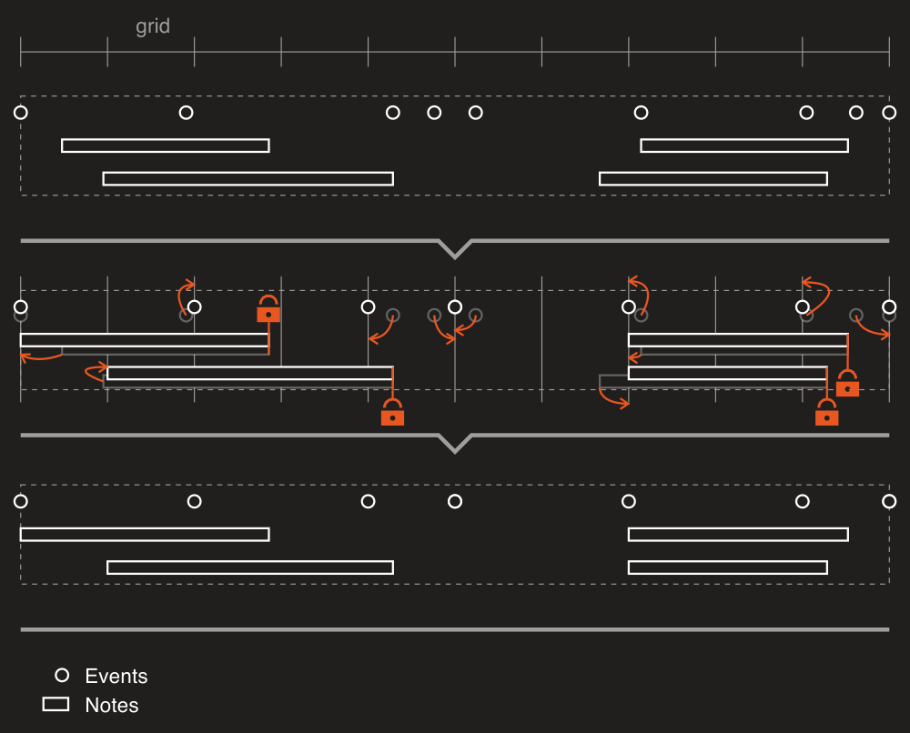
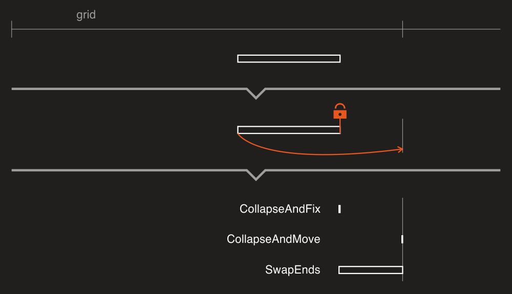

# Quantizer

DryWetMIDI provides a tool to perform quantizing of objects of different types by the specified grid. The class aimed to solve this task is [Quantizer](xref:Melanchall.DryWetMidi.Tools.Quantizer). Sections below describe usage of the tool in details.

Note that quantizing routine modifies passed objects instead of returning new ones with quantized times. So be sure you've cloned input objects if you want to save them. All classes implementing [ITimedObject](xref:Melanchall.DryWetMidi.Interaction.ITimedObject) as well as [MidiFile](xref:Melanchall.DryWetMidi.Core.MidiFile) and [TrackChunk](xref:Melanchall.DryWetMidi.Core.TrackChunk) have `Clone` method you can use for that purpose.

Also there are [QuantizerUtilities](xref:Melanchall.DryWetMidi.Tools.QuantizerUtilities) class that contains useful methods to quantize objects inside [TrackChunk](xref:Melanchall.DryWetMidi.Core.TrackChunk) and [MidiFile](xref:Melanchall.DryWetMidi.Core.MidiFile) without necessity to work with objects collections directly.

Please note that the article doesn't cover all settings and use cases so please read API documentation on [Quantizer](xref:Melanchall.DryWetMidi.Tools.Quantizer) to get complete information.

## General information

First of all let's see how arbitrary [timed objects](xref:Melanchall.DryWetMidi.Interaction.ITimedObject) quantized:


Quantizing can be adjusted in many ways by the [QuantizingSettings](xref:Melanchall.DryWetMidi.Tools.QuantizingSettings). Please read documentation on the class to see all available properties. For example, image below shows quantizing with different values of [QuantizingLevel](xref:Melanchall.DryWetMidi.Tools.QuantizingSettings.QuantizingLevel):


## Quantizing ILengthedObject

An arbitrary object implements [ITimedObject](xref:Melanchall.DryWetMidi.Interaction.ITimedObject) and thus its [Time](xref:Melanchall.DryWetMidi.Interaction.ITimedObject.Time) property gets quantized. But if an object implements [ILengthedObject](xref:Melanchall.DryWetMidi.Interaction.ILengthedObject) interface, you have several options:

* quantize start time;
* quantize end time;
* quantize both start and end times.

You choose the desired option specifying [QuantizingSettings.Target](xref:Melanchall.DryWetMidi.Tools.QuantizingSettings.Target) property.

By default if an object quantized, it will be entirely moved to a grid position. So if you quantize start time, end time can be changed since the object will be moved. You can see the process in action on the first image of the article. Of course this behavior can be altered. Just set [FixOppositeEnd](xref:Melanchall.DryWetMidi.Tools.QuantizingSettings.FixOppositeEnd) to `true` to prevent changing of time that is not the target of quantizing. The following image illustrates quantizing of start time with the property set to `true`:



Of course this property works in case of end time quantizing too.

When the start time of an object is not fixed, there is a chance that the object's end time will be quantized in a such way that the start time will be negative due to the object is moved to the left. Negative time is invalid so you can set [QuantizingSettings.QuantizingBeyondZeroPolicy](xref:Melanchall.DryWetMidi.Tools.QuantizingSettings.QuantizingBeyondZeroPolicy) property to desired value to handle this situation. The image below shows how quantizing works if the property set to [FixAtZero](xref:Melanchall.DryWetMidi.Tools.QuantizingBeyondZeroPolicy.FixAtZero):


Also if one side (start or end) of an object is fixed, there is a chance that the object's opposite time will be quantized in a such way that the object will be reversed resulting to negative length. You can handle this situation with [QuantizingSettings.QuantizingBeyondFixedEndPolicy](xref:Melanchall.DryWetMidi.Tools.QuantizingSettings.QuantizingBeyondFixedEndPolicy) property. The image below shows some options in action when start time is being quantized beyond the end one:



## Custom quantizing

You can derive from the [Quantizer](xref:Melanchall.DryWetMidi.Tools.Quantizer) class and override its [OnObjectQuantizing](xref:Melanchall.DryWetMidi.Tools.Quantizer.OnObjectQuantizing*) method. Inside this method you can decide whether quantizing for an object should be performed or not and if yes, what new time should be set.

Information about what quantizer is going to do with an object is passed via `quantizedTime` parameter of [QuantizedTime](xref:Melanchall.DryWetMidi.Tools.QuantizedTime) type. Image below shows what information is holded within this class:


**A**: [GridTime](xref:Melanchall.DryWetMidi.Tools.QuantizedTime.GridTime)

Grid time that was selected for an object as the nearest one.

**B**: [NewTime](xref:Melanchall.DryWetMidi.Tools.QuantizedTime.NewTime)

The new time of an object that was calculated during quantizing.

**C**: [DistanceToGridTime](xref:Melanchall.DryWetMidi.Tools.QuantizedTime.DistanceToGridTime)

The distance between an object's current time and the nearest grid time. There is also [ConvertedDistanceToGridTime](xref:Melanchall.DryWetMidi.Tools.QuantizedTime.ConvertedDistanceToGridTime) which holds the distance as [time span](xref:Melanchall.DryWetMidi.Interaction.ITimeSpan) of the type specified by [DistanceCalculationType](xref:Melanchall.DryWetMidi.Tools.QuantizingSettings.DistanceCalculationType) property of quantizing settings.

**D**: [Shift](xref:Melanchall.DryWetMidi.Tools.QuantizedTime.Shift)

The distance an object is going to be moved on toward the new time. If [QuantizingLevel](xref:Melanchall.DryWetMidi.Tools.QuantizingSettings.QuantizingLevel) is less than `1.0`, `D` will be less than `C`.

Let's create a simple custom quantizer. We will call it `SoftQuantizer`:

```csharp
public sealed class SoftQuantizer : Quantizer
{
    protected override TimeProcessingInstruction OnObjectQuantizing(
        ITimedObject obj,
        QuantizedTime quantizedTime,
        IGrid grid,
        LengthedObjectTarget target,
        TempoMap tempoMap,
        QuantizingSettings settings)
    {
        return (MusicalTimeSpan)quantizedTime.ConvertedDistanceToGridTime > MusicalTimeSpan.Eighth
            ? TimeProcessingInstruction.Skip
            : base.OnObjectQuantizing(obj, quantizedTime, grid, target, tempoMap, settings);
    }
}
```

What it does? If distance between an object and the nearest grid time is greater than `1/8`, just don't quantize the object. Otherwise do base quantizing.

Our small program to test the tool:

```csharp
class Program
{
    static void Main(string[] args)
    {
        var tempoMap = TempoMap.Default;
        var midiFile = new PatternBuilder()
            .SetNoteLength(MusicalTimeSpan.Eighth)

            .StepForward(MusicalTimeSpan.Sixteenth)
            .Note("A5")
                
            .StepForward(MusicalTimeSpan.Quarter)
            .Note("B2")
                
            .StepForward(new MusicalTimeSpan(3, 8))
            .Note("C#3")
                
            .Build()
            .ToFile(tempoMap);

        Console.WriteLine("Notes before quantizing:");
        PrintNotes(midiFile);

        midiFile.QuantizeObjects(
            new SoftQuantizer(),
            ObjectType.Note,
            new SteppedGrid(MusicalTimeSpan.Whole),
            new QuantizingSettings
            {
                DistanceCalculationType = TimeSpanType.Musical
            });

        Console.WriteLine("Notes after quantizing:");
        PrintNotes(midiFile);

        Console.WriteLine("Press any key to exit...");
        Console.ReadKey();
    }

    static void PrintNotes(MidiFile midiFile)
    {
        var notes = midiFile.GetNotes();
        var tempoMap = midiFile.GetTempoMap();

        foreach (var note in notes)
        {
            var time = note.TimeAs<MusicalTimeSpan>(tempoMap);
            var length = note.LengthAs<MusicalTimeSpan>(tempoMap);
            Console.WriteLine($"Note [{note}]: time = [{time}], length = [{length}]");
        }
    }
}
```

If we run the program, we'll get following output:

```text
Notes before quantizing:
Note [A5]: time = [1/16], length = [1/8]
Note [B2]: time = [7/16], length = [1/8]
Note [C#3]: time = [15/16], length = [1/8]
Notes after quantizing:
Note [A5]: time = [0/1], length = [1/8]
Note [B2]: time = [7/16], length = [1/8]
Note [C#3]: time = [1/1], length = [1/8]
Press any key to exit...
```

So all works as expected, middle note is not quantized since it's too far from grid times.