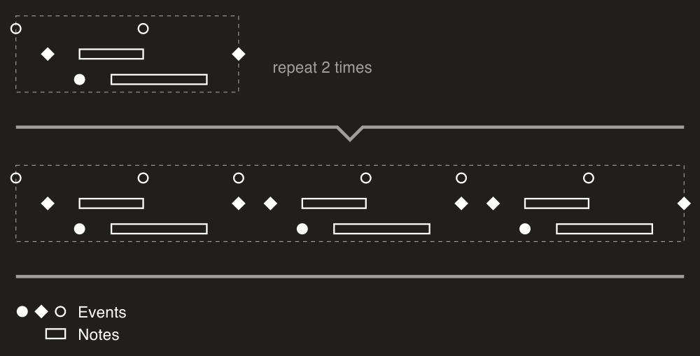
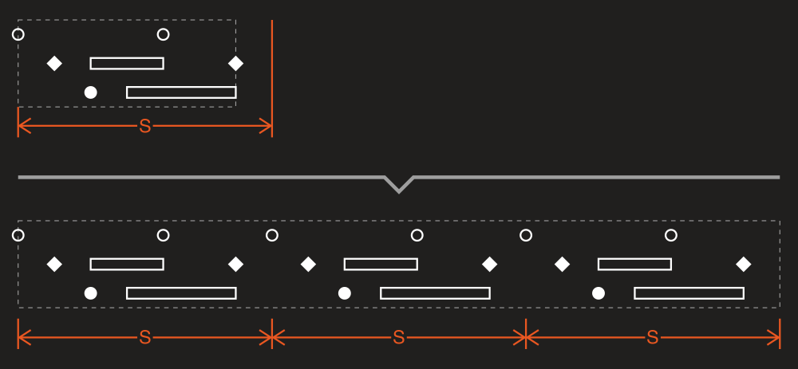
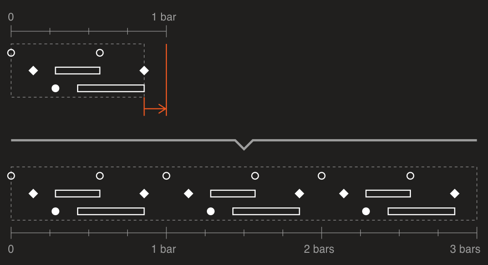
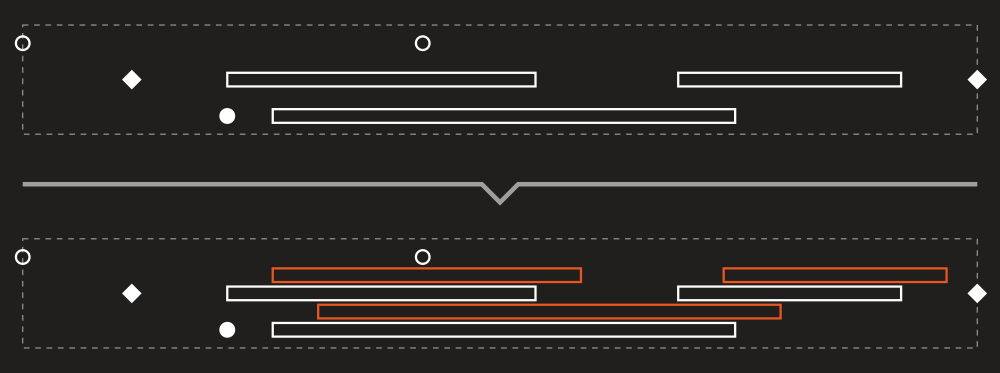

# Repeater

With DryWetMIDI you can easily repeat groups of objects or entire MIDI files using the dedicated tool - [Repeater](xref:Melanchall.DryWetMidi.Tools.Repeater). Quick example of repeating a group of different objects two times:



It's a simple case. To calculate the distance to move each new part by, the tool looks at the value of the [ShiftPolicy](xref:Melanchall.DryWetMidi.Tools.RepeatingSettings.ShiftPolicy) property of the settings passed to [Repeat](xref:Melanchall.DryWetMidi.Tools.Repeater.Repeat*) methods. The default value is [ShiftPolicy.ShiftByMaxTime](xref:Melanchall.DryWetMidi.Tools.ShiftPolicy.ShiftByMaxTime) and you can see how this options works on the image above - the tool takes maximum time among all objects and shifts objects within each new part by this value.

But you can use fixed value to shift objects by. You need to specify [ShiftPolicy.ShiftByFixedValue](xref:Melanchall.DryWetMidi.Tools.ShiftPolicy.ShiftByFixedValue) for shift policy and set [Shift](xref:Melanchall.DryWetMidi.Tools.RepeatingSettings.Shift) property of the settings. So times of objects won't affect distance calculation now and data will be shifted by the value of the `Shift` property:

```csharp
var newFile = midiFile.Repeat(2, new RepeatingSettings
{
    ShiftPolicy = ShiftPolicy.ShiftByFixedValue,
    Shift = new MetricTimeSpan(0, 0, 10)
});
```



Also [RepeatingSettings](xref:Melanchall.DryWetMidi.Tools.RepeatingSettings) class provides options to round shift value (calculated by max time or constant one). It can be useful, for example, when objects are not aligned with the grid. Please take a look at the following image:



Here the data doesn't reach bar line time, but we want to repeat the objects with aligning to bars lines. Obviously we can't use [ShiftPolicy.ShiftByMaxTime](xref:Melanchall.DryWetMidi.Tools.ShiftPolicy.ShiftByMaxTime) option here. But we can't use [ShiftPolicy.ShiftByFixedValue](xref:Melanchall.DryWetMidi.Tools.ShiftPolicy.ShiftByFixedValue) too because we don't know the length of data in general case. We just want to repeat the objects and be sure the start of the objects group is always on a bar line. So we can write this code:

```csharp
var newFile = midiFile.Repeat(2, new RepeatingSettings
{
    ShiftPolicy = ShiftPolicy.ShiftByMaxTime,
    ShiftRoundingPolicy = TimeSpanRoundingPolicy.RoundUp,
    ShiftRoundingStep = new BarBeatTicksTimeSpan(1)
});
```

We tell the tool here to round calculated shift value up using the step of `1` bar. By default [ShiftRoundingPolicy](xref:Melanchall.DryWetMidi.Tools.RepeatingSettings.ShiftRoundingPolicy) property is set to [TimeSpanRoundingPolicy.NoRounding](xref:Melanchall.DryWetMidi.Interaction.TimeSpanRoundingPolicy.NoRounding) but you can also set it [TimeSpanRoundingPolicy.RoundDown](xref:Melanchall.DryWetMidi.Interaction.TimeSpanRoundingPolicy.RoundDown) along with [TimeSpanRoundingPolicy.RoundUp](xref:Melanchall.DryWetMidi.Interaction.TimeSpanRoundingPolicy.RoundUp) shown above. Please see documentation on [TimeSpanRoundingPolicy](xref:Melanchall.DryWetMidi.Interaction.TimeSpanRoundingPolicy) to learn more about rounding.

## Custom repeater

You can derive from the [Repeater](xref:Melanchall.DryWetMidi.Tools.Repeater) class to make your own repeating logic. Let's imagine we want to repeat all notes transposing each repeated note by three semitones up and shifting it by `1/4` forward. So we need to skip non-note events and disable automatic shifting. The following image illustrates what we want to achieve:



Well, our custom repeater class will be:

```csharp
private sealed class CustomRepeater : Repeater
{
    protected override void ProcessPart(PartProcessingContext context)
    {
        base.ProcessPart(context);

        var newObjects = context
            .PartObjects
            .Where(obj => ((TimedEvent)obj).Event is NoteEvent)
            .ToArray();

        context.PartObjects.Clear();

        foreach (var obj in newObjects)
        {
            ((NoteEvent)((TimedEvent)obj).Event).NoteNumber += (SevenBitNumber)((context.PartIndex + 1) * 3);

            var originalTime = obj.TimeAs<MusicalTimeSpan>(context.SourceTempoMap);
            obj.SetTime(
                originalTime.Add(MusicalTimeSpan.Quarter * (context.PartIndex + 1), TimeSpanMode.TimeLength),
                context.SourceTempoMap);
            
            context.PartObjects.Add(obj);
        }
    }
}
```

And we will use it in this way:

```csharp
var newFile = new CustomRepeater().Repeat(midiFile, 3, new RepeatingSettings
{
    ShiftPolicy = ShiftPolicy.None
});
```