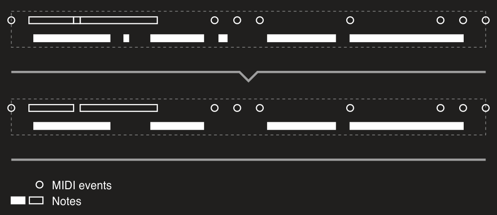
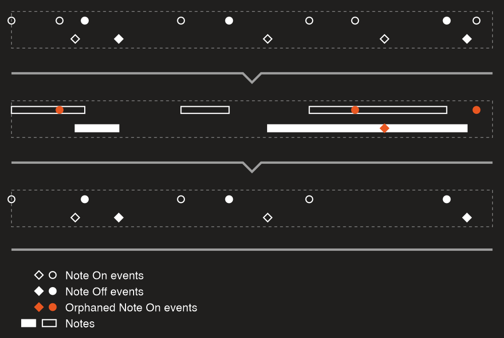
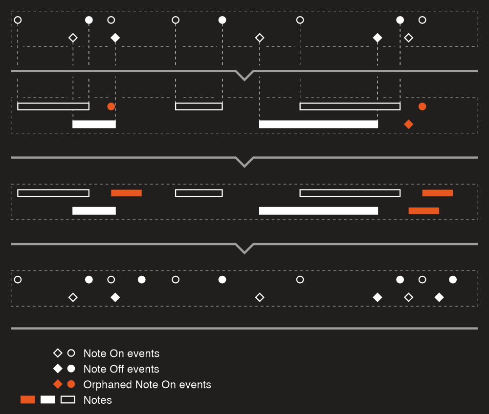
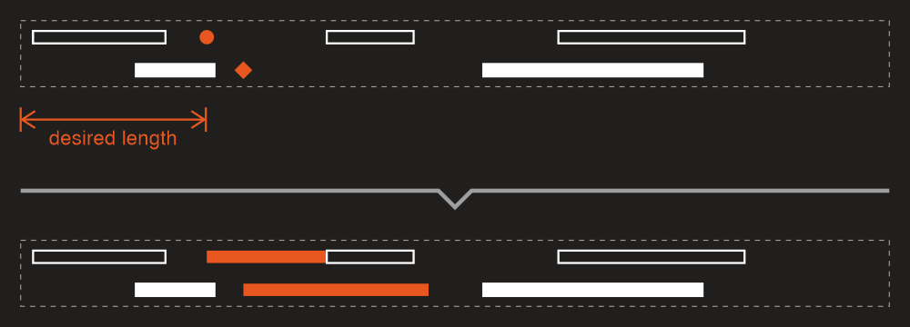
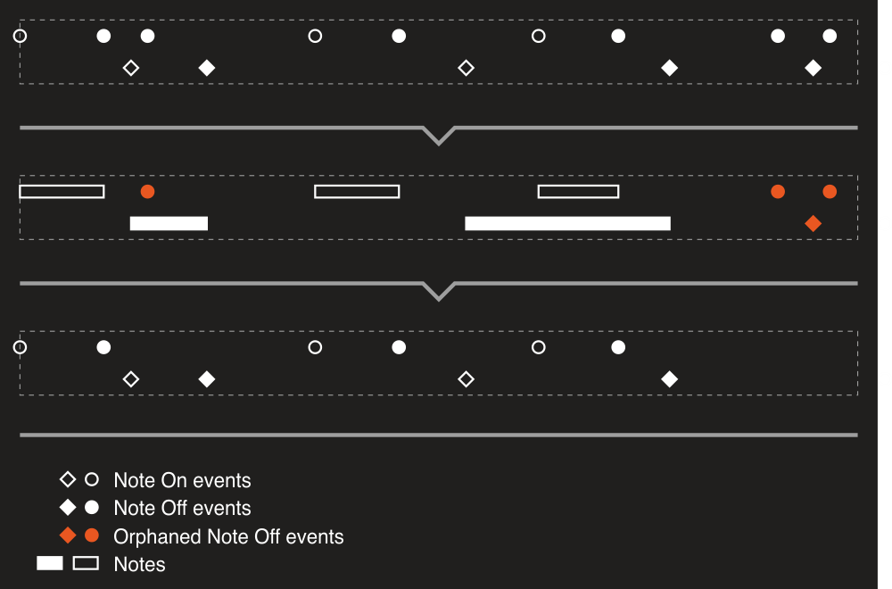

---
uid: a_sanitizer
---

# Sanitizer

DryWetMIDI provides a tool to clean a MIDI file by removing redundant events and so on – [Sanitizer](xref:Melanchall.DryWetMidi.Tools.Sanitizer). The process can be run via the [Sanitize](xref:Melanchall.DryWetMidi.Tools.Sanitizer.Sanitize*) extension method:

```csharp
midiFile.Sanitize();
```

It's a simple example that shows how you can perform all supported cleaning procedures. You can pass an instance of the [SanitizingSettings](xref:Melanchall.DryWetMidi.Tools.SanitizingSettings) to the method turning off or on desired options:

```csharp
midiFile.Sanitize(new SanitizingSettings
{
    NoteMinLength = MusicalTimeSpan.Quarter,
    RemoveEmptyTrackChunks = false
});
```

Here we're removing all notes that are shorter than `1/4` leaving track chunks without events untouched. Please see detailed descriptions of settings below.

## Settings

The [Sanitizer](xref:Melanchall.DryWetMidi.Tools.Sanitizer) class provides a rich set of options you can manage sanitizing of a MIDI file with.

### NoteMinLength

[NoteMinLength](xref:Melanchall.DryWetMidi.Tools.SanitizingSettings.NoteMinLength) property of the [SanitizingSettings](xref:Melanchall.DryWetMidi.Tools.SanitizingSettings) sets a minimum length for notes within an input file. All notes that are shorter than this value will be removed.

The default value is `null` which means notes can have any length. The same behavior can be achieved with a value of zero length. This should be read as "a note should not be removed if its length is zero or greater".

Image below shows how you can get rid of short notes with this option:



Please notice that how notes will be detected is handled by the [NoteDetectionSettings](xref:Melanchall.DryWetMidi.Tools.SanitizingSettings.NoteDetectionSettings) property. You can read more about the [NoteDetectionSettings](xref:Melanchall.DryWetMidi.Interaction.NoteDetectionSettings) class in the [Getting objects: GetNotes: Settings](xref:a_getting_objects#settings) article.

### NoteMinVelocity

[NoteMinVelocity](xref:Melanchall.DryWetMidi.Tools.SanitizingSettings.NoteMinVelocity) property of the [SanitizingSettings](xref:Melanchall.DryWetMidi.Tools.SanitizingSettings) sets a minimum velocity for notes within an input file. All notes with velocity below this value will be removed. The default value is zero which means notes can have any velocity (zero or above).

For example, if we have such a file with two notes (with numbers of `70` and `50`):

```csharp
var midiFile = new MidiFile(
    new TrackChunk(
        new NoteOnEvent((SevenBitNumber)70, (SevenBitNumber)50),
        new NoteOffEvent((SevenBitNumber)70, (SevenBitNumber)0),
        new NoteOnEvent((SevenBitNumber)50, (SevenBitNumber)40),
        new NoteOffEvent((SevenBitNumber)50, (SevenBitNumber)0)));
```

then this instruction will remove the second one:

```csharp
midiFile.Sanitize(new SanitizingSettings
{
    NoteMinVelocity = (SevenBitNumber)45
});
```

### RemoveDuplicatedNotes

[RemoveDuplicatedNotes](xref:Melanchall.DryWetMidi.Tools.SanitizingSettings.RemoveDuplicatedNotes) property of the [SanitizingSettings](xref:Melanchall.DryWetMidi.Tools.SanitizingSettings) determines whether duplicated notes should be removed or not. The default value is `true`.

Notes are considered duplicated when they are meet all the following conditions:

* same note number;
* same channel;
* same time;
* same length.

For example, if we have such a file with two notes (with number of `70` and length of `20`):

```csharp
var midiFile = new MidiFile(
    new TrackChunk(
        new NoteOnEvent((SevenBitNumber)70, (SevenBitNumber)50),
        new NoteOnEvent((SevenBitNumber)70, (SevenBitNumber)40),
        new NoteOffEvent((SevenBitNumber)70, (SevenBitNumber)0) { DeltaTime = 20 },
        new NoteOffEvent((SevenBitNumber)70, (SevenBitNumber)0)));
```

then this instruction will remove the second one:

```csharp
midiFile.Sanitize();
```

### RemoveEmptyTrackChunks

[RemoveEmptyTrackChunks](xref:Melanchall.DryWetMidi.Tools.SanitizingSettings.RemoveEmptyTrackChunks) property determines whether track chunks without MIDI events should be removed or not.

### OrphanedNoteOnEventsPolicy

In some MIDI files you can encounter [Note On](xref:Melanchall.DryWetMidi.Core.NoteOnEvent) events without corresponding [Note Off](xref:Melanchall.DryWetMidi.Core.NoteOffEvent) ones. For example, here we're creating a file with the first event is an orphaned _Note On_ one:

```csharp
var midiFile = new MidiFile(
    new TrackChunk(
        new NoteOnEvent(),
        new TextEvent("A")));
```

Of course how notes are detected is controlled by the [NoteDetectionSettings](xref:Melanchall.DryWetMidi.Tools.SanitizingSettings.NoteDetectionSettings) property. As stated above you can read more about the [NoteDetectionSettings](xref:Melanchall.DryWetMidi.Interaction.NoteDetectionSettings) class in the [Getting objects: GetNotes: Settings](xref:a_getting_objects#settings) article.

[Sanitizer](xref:Melanchall.DryWetMidi.Tools.Sanitizer) allows to handle such orphaned _Note On_ events in different ways with the [OrphanedNoteOnEventsPolicy](xref:Melanchall.DryWetMidi.Tools.SanitizingSettings.OrphanedNoteOnEventsPolicy) property.

Following image shows how [OrphanedNoteOnEventsPolicy.Remove](xref:Melanchall.DryWetMidi.Tools.OrphanedNoteOnEventsPolicy.Remove) option (which is the default one) works:



But what if such orphaned Note On events are just a result of corresponding Note Off ones were lost for some reason? You'll probably want to restore notes. In this case you can use [OrphanedNoteOnEventsPolicy.CompleteNote](xref:Melanchall.DryWetMidi.Tools.OrphanedNoteOnEventsPolicy.CompleteNote) option. It will add a _Note Off_ event for each orphaned _Note On_ one. The length of the note is controlled by the [NoteMaxLengthForOrphanedNoteOnEvent](xref:Melanchall.DryWetMidi.Tools.SanitizingSettings.NoteMaxLengthForOrphanedNoteOnEvent) property. Please see the image below which describes the process:



As you can see from the name of the property, it's the **maximum** length of a note. If Note On event with the same channel and note number is encountered during the new note, the note's length will be reduced so its end will be at the start of a next note:



### RemoveOrphanedNoteOffEvents

Obviously [Note Off](xref:Melanchall.DryWetMidi.Core.NoteOffEvent) events can be orphaned too (see [OrphanedNoteOnEventsPolicy](#orphanednoteoneventspolicy) above) and you can remove such events too using the [RemoveOrphanedNoteOffEvents](xref:Melanchall.DryWetMidi.Tools.SanitizingSettings.RemoveOrphanedNoteOffEvents) property:



### RemoveDuplicatedSetTempoEvents

If we create a MIDI file like that:

```csharp
var midiFile = new MidiFile(
    new TrackChunk(
        new SetTempoEvent(100),
        new TextEvent("A"),
        new SetTempoEvent(100),
        new TextEvent("B"),
        new SetTempoEvent(200),
        new TextEvent("C"),
        new SetTempoEvent(200)));
```

we'll notice that the second and last [Set Tempo](xref:Melanchall.DryWetMidi.Core.SetTempoEvent) events are redundant. The file above is equivalent to this one:

```csharp
var midiFile = new MidiFile(
    new TrackChunk(
        new SetTempoEvent(100),
        new TextEvent("A"),
        new TextEvent("B"),
        new SetTempoEvent(200),
        new TextEvent("C")));
```

[RemoveDuplicatedSetTempoEvents](xref:Melanchall.DryWetMidi.Tools.SanitizingSettings.RemoveDuplicatedSetTempoEvents) property allows to remove redundant [Set Tempo](xref:Melanchall.DryWetMidi.Core.SetTempoEvent) events:


So _Set Tempo_ events are considered duplicated when they are have the same microseconds per quarter note value.

### RemoveDuplicatedTimeSignatureEvents

[RemoveDuplicatedTimeSignatureEvents](xref:Melanchall.DryWetMidi.Tools.SanitizingSettings.RemoveDuplicatedTimeSignatureEvents) does the same actions as the [RemoveDuplicatedSetTempoEvents](#removeduplicatedsettempoevents) one but for duplicated [Time Signature](xref:Melanchall.DryWetMidi.Core.TimeSignatureEvent) events.

_Time Signature_ events are considered duplicated when they are meet all the following conditions:

* same numerator;
* same denominator;
* same clock ticks per click;
* same thirty-second notes per beat.

### RemoveDuplicatedPitchBendEvents

[RemoveDuplicatedPitchBendEvents](xref:Melanchall.DryWetMidi.Tools.SanitizingSettings.RemoveDuplicatedPitchBendEvents) does the same actions as the [RemoveDuplicatedSetTempoEvents](#removeduplicatedsettempoevents) or [RemoveDuplicatedTimeSignatureEvents](#removeduplicatedtimesignatureevents) one but for duplicated [Pitch Bend](xref:Melanchall.DryWetMidi.Core.PitchBendEvent) events.

_Pitch Bend_ events are considered duplicated when they are meet all the following conditions:

* same pitch value;
* same channel.

### RemoveDuplicatedSequenceTrackNameEvents

[RemoveDuplicatedSequenceTrackNameEvents](xref:Melanchall.DryWetMidi.Tools.SanitizingSettings.RemoveDuplicatedSequenceTrackNameEvents) does the same actions as the [RemoveDuplicatedSetTempoEvents](#removeduplicatedsettempoevents) or [RemoveDuplicatedTimeSignatureEvents](#removeduplicatedtimesignatureevents) one but for duplicated [Sequence/Track Name](xref:Melanchall.DryWetMidi.Core.SequenceTrackNameEvent) events.

_Sequence/Track Name_ events are considered duplicated when they have the same text.

### RemoveDuplicatedControlChangeEvents

[RemoveDuplicatedControlChangeEvents](xref:Melanchall.DryWetMidi.Tools.SanitizingSettings.RemoveDuplicatedControlChangeEvents) does the same actions as the [RemoveDuplicatedSetTempoEvents](#removeduplicatedsettempoevents) or [RemoveDuplicatedTimeSignatureEvents](#removeduplicatedtimesignatureevents) one but for duplicated [Control Change](xref:Melanchall.DryWetMidi.Core.ControlChangeEvent) events.

_Control Change_ events are considered duplicated when they are meet all the following conditions:

* same control number;
* same control value;
* same channel.

### RemoveEventsOnUnusedChannels

If a MIDI file doesn't contain notes on some channel, we can safely remove all events on that channel. For example, the [Control Change](xref:Melanchall.DryWetMidi.Core.ControlChangeEvent) event on channel `2` in the following example is redundant:

```csharp
var midiFile = new MidiFile(
    new TrackChunk(
        new ControlChangeEvent { Channel = (FourBitNumber)2 },
        new ControlChangeEvent { Channel = (FourBitNumber)5 },
        new NoteOnEvent { Channel = (FourBitNumber)5 },
        new NoteOffEvent { Channel = (FourBitNumber)5 }));
```

[RemoveEventsOnUnusedChannels](xref:Melanchall.DryWetMidi.Tools.SanitizingSettings.RemoveEventsOnUnusedChannels) property turns on or off removing such channel events that have no effect since there are no notes on those channels:


### Trim

[Trim](xref:Melanchall.DryWetMidi.Tools.SanitizingSettings.Trim) property allows to automatically remove an empty space at the start of a MIDI file. For example:

```csharp
var midiFile = new MidiFile(
    new TrackChunk(
        new TextEvent("A") { DeltaTime = 20 }),
    new TrackChunk(
        new TextEvent("B") { DeltaTime = 30 },
        new TextEvent("C") { DeltaTime = 15 }));
```

Here we have a silence of 20 ticks at the start of the file. So after sanitizing with `Trim` property set to `true` we will have this file:

```csharp
var midiFile = new MidiFile(
    new TrackChunk(
        new TextEvent("A") { DeltaTime = 0 }),
    new TrackChunk(
        new TextEvent("B") { DeltaTime = 10 },
        new TextEvent("C") { DeltaTime = 15 }));
```

The default value is `false` since this behavior can be undesired.