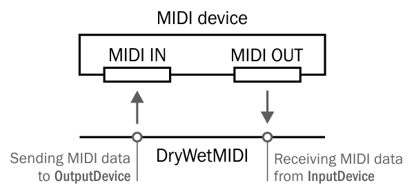

**Please note that Devices API is Windows only at now.**

DryWetMIDI provides ability to send MIDI data to or receive it from MIDI devices. For that purpose there are following classes:

* [InputDevice](Input-device.md)
* [OutputDevice](Output-device.md)
* [DevicesConnector](Devices-connector.md)

All these classes implement [`IDisposable`](https://docs.microsoft.com/en-us/dotnet/api/system.idisposable) and you should always dispose them to free devices for using by another applications. You can read more details about MIDI devices API by following links above.

MIDI devices API classes are placed in the `Melanchall.DryWetMidi.Devices` namespace.

To understand what is input and output device in DryWetMIDI take a look at following image:



So, as you can see, although a MIDI port is _MIDI IN_ for hardware device, it will be an output device (`OutputDevice`) in DryWetMIDI because your application will **send MIDI data to** this port. _MIDI OUT_ of hardware device will be an input device (`InputDevice`) in DryWetMIDI because a program will **receive MIDI data from** the port.

`InputDevice` and `OutputDevice` are derived from `MidiDevice` class which has following public members:

```csharp
public abstract class MidiDevice : IDisposable
{
    // ...
    public event EventHandler<ErrorOccurredEventArgs> ErrorOccurred;
    // ...
    public int Id { get; }
    public string Name { get; }
    public Manufacturer DriverManufacturer { get; }
    public ushort ProductIdentifier { get; }
    public Version DriverVersion { get; }
    // ...
}
```

If some error occured during sending or receiving a MIDI event, the `ErrorOccurred` event will be fired holding an exception caused the error.