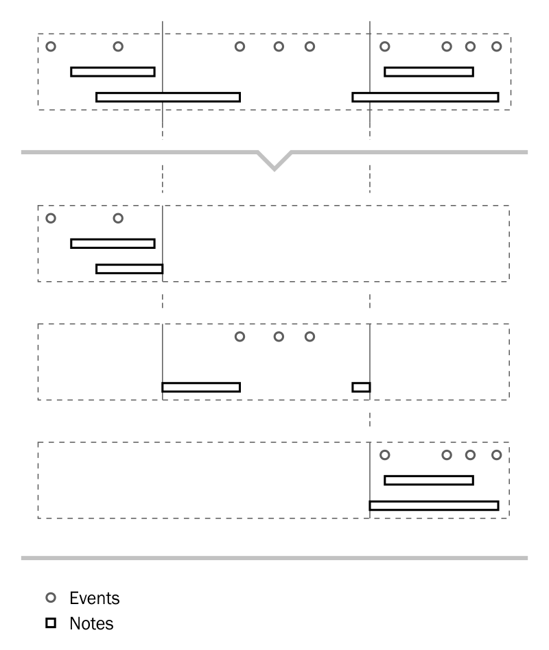
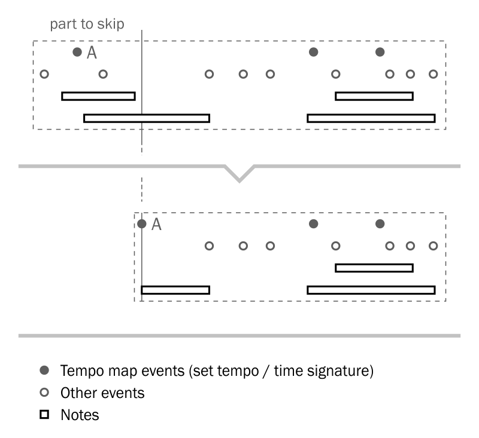
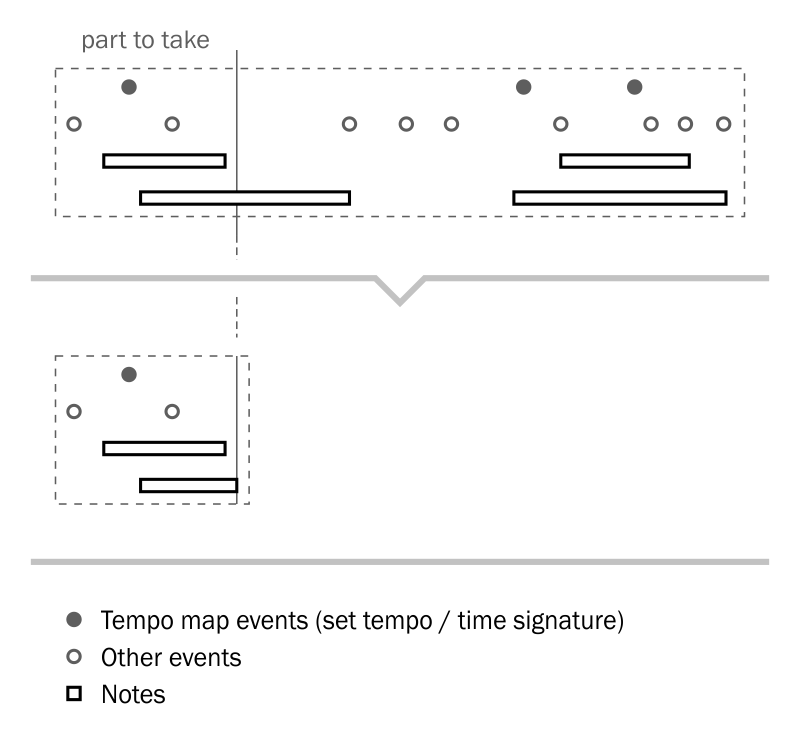
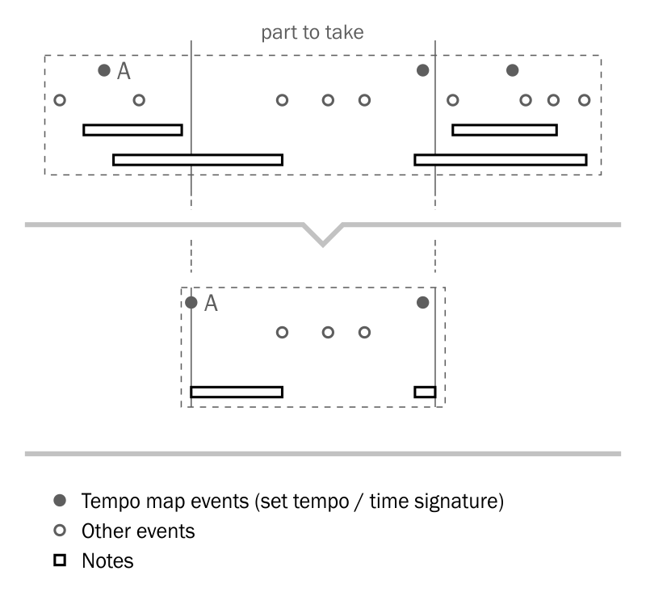

You can split MIDI file in different ways using extension methods from the `MidiFileSplitter` class. Available methods of splitting are described below.

### `SplitByChannel`

```csharp
IEnumerable<MidiFile> SplitByChannel(this MidiFile midiFile)
```

Splits MIDI file by channel so all [channel events](Channel-events.md) will be separated by channel and copied to corresponding new files. All meta and system exclusive events will be copied to all the new files. Non-track chunks will not be copied to any of the new files. Thus each file from the result will contain all meta and sysex events and channel events for single channel. The image below illustrates this process:


### `SplitByNotes`

```csharp
IEnumerable<MidiFile> SplitByNotes(this MidiFile midiFile)
```

Splits MIDI file by notes. Note events will be separated by note number and copied to corresponding new files. All other channel events, meta and system exclusive events will be copied to all the new files. Non-track chunks will not be copied to any of the new files. The image below illustrates splitting by notes:


### `SplitByGrid`

```csharp
IEnumerable<MidiFile> SplitByGrid(this MidiFile midiFile,
                                  IGrid grid,
                                  SliceMidiFileSettings settings = null)
```

Splits MIDI file by the specified grid. Each file will preserve original tempo map. The image below shows general case of splitting a MIDI file by grid:


Splitting can be adjusted via `settings` parameter of the `SliceMidiFileSettings` type. Properties provided by this class are described below.

#### `bool SplitNotes`

Indicates whether notes should be splitted in points of grid intersection or not. The default value is `true`. If `false` used, notes treated as just Note On / Note Off events rather than note objects. Splitting notes produces new Note On / Note Off events at points of grid intersecting notes if the proeprty set to `true`. The following image shows splitting by grid if `SplitNotes` set to `false`:


#### `bool PreserveTimes`

Indicates whether original times of events should be saved or not. The default value is `false`. If `false` used, events will be moved to the start of a new file. If `true` used, events will be placed in new files at the same times as in the input file. The following image shows splitting in case of `PreserveTimes` set to `true`:



#### `bool PreserveTrackChunks`

Indicates whether track chunks in new files should correspond to those in the input file or not, so empty track chunks can be presented in new files or not. The default value is `false` meaning track chunks without events will be removed from the result.

### `SkipPart`

```csharp
MidiFile SkipPart(this MidiFile midiFile,
                  ITimeSpan partLength,
                  SliceMidiFileSettings settings = null)
```

Skips part of the specified length of MIDI file and returns remaining part as an instance of `MidiFile`. The image below shows general case of skipping a part of a MIDI file:



Splitting can be adjusted via `settings` parameter of the `SliceMidiFileSettings` type. Properties provided by this class are described at [SplitByGrid](#splitbygrid).

### `TakePart`

```csharp
MidiFile TakePart(this MidiFile midiFile,
                  ITimeSpan partLength,
                  SliceMidiFileSettings settings = null)
```
```csharp
MidiFile TakePart(this MidiFile midiFile,
                  ITimeSpan partStart,
                  ITimeSpan partLength,
                  SliceMidiFileSettings settings = null)
```

Takes part of the specified length of a MIDI file (starting at the start or at the specified time within the file) and returns it as an instance of `MidiFile`. The image below shows both cases of taking a part of a MIDI file:





Splitting can be adjusted via `settings` parameter of the `SliceMidiFileSettings` type. Properties provided by this class are described at [SplitByGrid](#splitbygrid).