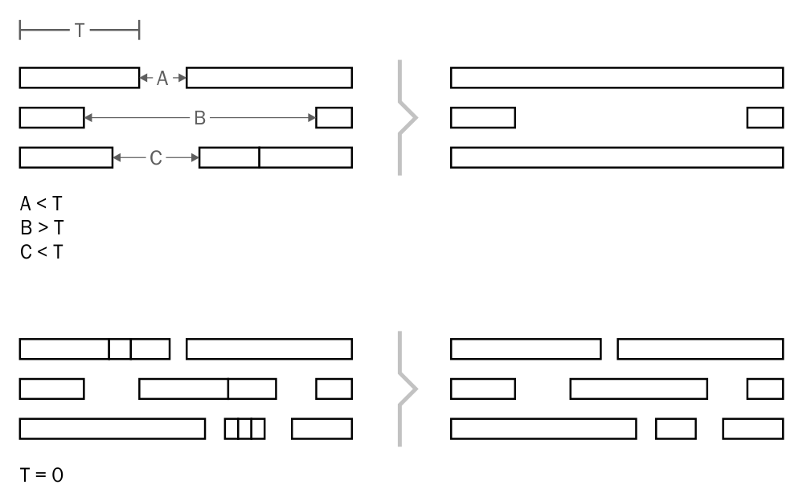

To merge nearby notes into one DryWetMIDI provides `NotesMerger` class which contains the method:

```csharp
IEnumerable<Note> Merge(IEnumerable<Note> notes,
                        TempoMap tempoMap,
                        NotesMergingSettings settings = null)
```

Example of usage:

```csharp
var notes = midiFile.GetNotes().Where(n => n.NoteName == NoteName.CSharp);
var tempoMap = midiFile.GetTempoMap();

var notesMerger = new NotesMerger();
notesMerger.Merge(notes,
                  tempoMap,
                  new NotesMergingSettings
                  {
                      Tolerance = new MetricTimeSpan(0, 0, 1)
                  });

// Note that notes obtained via GetNotes are detached from the file so if you
// call GetNotes on the file again, you will get original unmerged notes. To
// update notes in the file or specific track chunk you should use NotesManager
// as described in Notes section of the Wiki
```

Also there are useful methods inside `NotesMergerUtilities` class that allows quickly merge nearby notes inside `TrackChunk` or `MidiFile` without messing with updating notes via `NotesManager`. Example above can be rewritten to the following code:

```csharp
midiFile.MergeNotes(new NotesMergingSettings
                    {
                        Tolerance = new MetricTimeSpan(0, 0, 1)
                    },
                    n => n.NoteName == NoteName.CSharp);
```

Let's see how process of merging can be adjusted via `NotesMergingSettings` looking at the properties of this class.

#### `VelocityMergingPolicy`

Determines how `Velocity` of notes should be merged. The default value is `VelocityMergingPolicy.First`. Possible values are:

Value | Description
----- | -----------
`First` | Take velocity of first note.
`Last` | Take velocity of last note.
`Min` | Take minimum velocity.
`Max` | Take maximum velocity.
`Average` | Take average velocity.

#### `OffVelocityMergingPolicy`

Determines how `OffVelocity` (velocity of the Note Off event for a note) of notes should be merged. The default value is `VelocityMergingPolicy.Last`. Possible values are listed in the table above.

#### `Tolerance`

Maximum distance between two notes to consider them as nearby. The default value is time span of zero length, so two notes should have no gap between them to me merged. The image below shows how tolerance affects merging:

