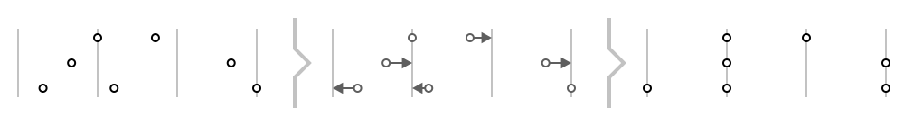
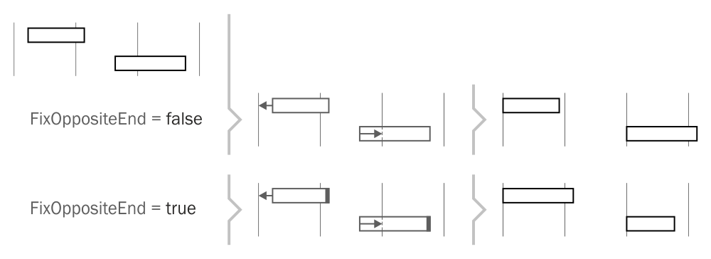
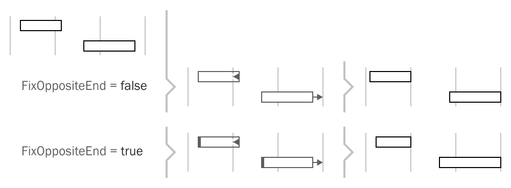
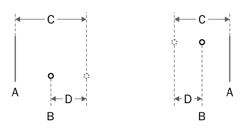

DryWetMIDI provides tools to perform quantizing of timed events, notes and chords by the specified grid. The classes aimed to solve this task are:

* `TimedEventsQuantizer`
* `NotesQuantizer`
* `ChordsQuantizer`

Sections below describe usage of them in details.

Grid is passed to the `Quantize` method of those classes as `IGrid` interface. DryWetMIDI provides two built-in grid implementations:

* `SteppedGrid` for grid started at the specified time where times distanced from each other with the specified steps. Such grid allows to perform _groove quantizing_ where collection of steps defines pattern of repeating distances between grid's times.
* `ArbitraryGrid` for grid where collection of times is specified as the constructor's argument. Such grid allows to quantize objects by custom collection of times which can be distributed in absolutely irregular way.

Note that quantizing routine modifies passed objects instead of returning new ones with quantized times. So be sure you've cloned input objects if you want to save them. `TimedEvent`, `Note` and `Chord` classes have Clone method you can use for that purpose.

Also there are `TimedEventsQuantizerUtilities`, `NotesQuantizerUtilities` and `ChordsQuantizerUtilities` classes that contain useful methods to quantize objects inside `TrackChunk` and `MidiFile` without necessity to work with collection of timed events, notes or chords directly.

### Quantizing timed events

Timed events can be quantized with `Quantize` method of the `TimedEventsQuantizer` class:

```csharp
void Quantize(IEnumerable<TimedEvent> objects,
              IGrid grid,
              TempoMap tempoMap,
              TimedEventsQuantizingSettings settings = null)
```

The image below illustrates quantizing of timed events:



The following image shows _groove quantizing_. Grid's times will be distributed according to the provided steps. So distance between first pair of adjacent times will be equal to first step, distance between second pair of adjacent times will be equal to second step and so on. When last step reached, steps will go from the first one.


Let's see available settings provided by `TimedEventsQuantizingSettings`.

#### `DistanceCalculationType`

Defines the type of distance calculation between an object's time and grid's times. For example, if the type is set to `Metric`, the grid's time with minimal count of microseconds between it and an object's time will be selected. But if you use `Musical` type, the grid's time where distance between it and an object's time represent smallest fraction of the whole note's length will be selected. The default value is `Midi` and you should always set this property to get desired result. Possible values are listed in the table below:

Value | Description
----- | -----------
`Metric` | Calculate distances in terms of number of microseconds.
`Musical` | Calculate distances in terms of fraction of the whole note's length.
`BarBeatTicks` | Calculate distances in terms of number of bars, beats and ticks.
`BarBeatFraction` | Calculate distances in terms of number of bars and fractional beats.
`Midi` | Calculate distances in terms of number of MIDI ticks.

#### `QuantizingLevel`

The level of quantizing from 0.0 (no quantizing) to 1.0 (full quantizng). This setting specifies how close an object should be moved to nearest grid time. For example, 0.5 will lead to an object will be moved half the distance between its time and the nearest grid time. The following image shows how this setting affects quantizing process:


### Quantizing notes and chords

For quantizing notes and chords there are `NotesQuantizer` and `ChordsQuantizer` classes respectively. Both classes provide `Quantize` method:

```csharp
void Quantize(IEnumerable<Note> objects,
              IGrid grid,
              TempoMap tempoMap,
              NotesQuantizingSettings settings = null)

void Quantize(IEnumerable<Chord> objects,
              IGrid grid,
              TempoMap tempoMap,
              ChordsQuantizingSettings settings = null)
```

`Note` and `Chord` are objects that have length so there are two options:

* quantize start time;
* quantize end time.

Both `NotesQuantizingSettings` and `ChordsQuantizingSettings` have the same set of properties:

#### `QuantizingTarget`

Gets or sets the side of an object that should be quantized. The default value is `LengthedObjectTarget.Start` so the start time of an object will be quantized.

The type of this property is `LengthedObjectTarget` enum. Values are listed in the table below:

Value | Description
----- | -----------
`Start` | Quantize start time of objects.
`End` | Quantize end time of objects.

#### `FixOppositeEnd`

Gets or sets a value indicating whether an opposite side of an object should be fixed or not. The default value is `false`. Note that in case of an object's side is fixed the length can be changed during quantizing.

The following image illustrates quantizing of start time with different values of this property.



and quantizing of end time:



#### `DistanceCalculationType`

Gets or sets the type of calculation distance between an object's time and grid's times. The purpose of this property described in [Quantizing timed events](#quantizing-timed-events) section.

#### `LengthType`

Gets or sets the type of an object's length that should be kept in case the opposite side is not fixed (`FixOppositeEnd` is set to `false`). The default value is `TimeSpanType.Midi`. Similar to `DistanceCalculationType` property you should always set it to get the result you're expecting. For example, with `Metric` type an object's length will represent the same number of microseconds before and after quantizing. But if you use `Musical` type, an object's length will represent the same fraction of the whole note's length before and after quantizing.

The type of this property is `TimeSpanType` enum. Values are listed in the table below:

Value | Description
----- | -----------
`Metric` | Keep length as number of microseconds.
`Musical` | Keep length as fraction of the whole note's length.
`BarBeatTicks` | Keep length as number of bars, beats and ticks.
`BarBeatFraction` | Keep length as number of bars and fractional beats.
`Midi` | Keep length as number of MIDI ticks.

#### `QuantizingBeyondZeroPolicy`

Gets or sets policy according to which quantizer should act in case of an object is going to be moved beyond zero. The default value is `QuantizingBeyondZeroPolicy.FixAtZero`. When the start time of an object is not fixed, there is a chance that the object's end time will be quantized in a such way that the start time will be negative due to the object is moved to the left. Negative time is invalid so this policy provides options to prevent this situation.

The type of this property is `QuantizingBeyondZeroPolicy` enum. Values are listed in the table below:

Value | Description
----- | -----------
`FixAtZero` | Object will be shrinked due to end time quantizing and fixed at zero.
`Skip` | Object will be skipped so quantizing will not be applied to it.
`Abort` | Throw an exception aborting quantizing.

The image below shows those options when end time quantizing leads to object will be moved beyond zero:


#### `QuantizingBeyondFixedEndPolicy`

Gets or sets policy according to which a quantizer should act in case of object's side is going to be moved beyond an opposite one that is fixed. The default value is `QuantizingBeyondFixedEndPolicy.CollapseAndFix`. When one end of an object is fixed, there is a chance that the object's opposite end will be quantized in a such way that the object will be reversed resulting to negative length. This policy provides options to prevent this situation.

The type of this property is `QuantizingBeyondFixedEndPolicy` enum. Values are listed in the table below:

Value | Description
----- | -----------
`CollapseAndFix` | Object will be collapsed and fixed at fixed end's time.
`CollapseAndMove` | Object will be collapsed and moved to the new time calculated by a quantizer.
`SwapEnds` | Ends of an object will be swapped.
`Skip` | Object will be skipped so quantizing will not be applied to it.
`Abort` | Throw an exception aborting quantizing.

The image below shows those options when start time is being quantized beyond the end one:


and for end time quantizing:


### Custom quantizing

You can derive from any of the quantizer classes provided by DryWetMIDI and override `OnObjectQuantizing` protected method. Inside this method you can decide whether quantizing for an object should be performed or not. You can also modify the time that will be set to the object. Signature of the method is:

```csharp
TimeProcessingInstruction OnObjectQuantizing(TObject obj,
                                             QuantizedTime quantizedTime,
                                             IGrid grid,
                                             TempoMap tempoMap,
                                             TSettings settings)
```

You should return an instance of the `TimeProcessingInstruction` class that holds an action quantizer should do and the new time. Action is defined by the `TimeProcessingAction` enum. Possible values are:

Value | Description
----- | -----------
`Apply` | Set new time to an object.
`Skip` | Skip an object and leave its time untouched.

`quantizedTime` parameter holds information about new time for an object that was calculated during quantizing. Let's look at properties the `QuantizedTime` class provides:



#### `long GridTime` (A)

Grid time that was selected for an object as the nearest one.

#### `long NewTime` (B)

The new time of an object that was calculated during quantizing.

#### `long DistanceToGridTime` (C)

The distance between an object's current time and the nearest grid time.

#### `ITimeSpan ConvertedDistanceToGridTime`

The distance between an object's current time and the nearest grid time as time span of the type specified by `DistanceCalculationType` of quantizing settings.

#### `ITimeSpan Shift` (D)

The distance an object is going to be moved on toward the new time.