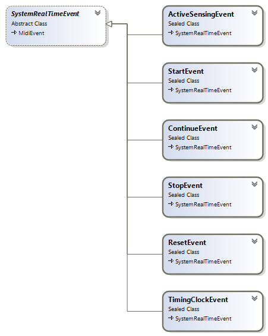

System realtime events are those that are not specific to a MIDI channel but prompt all devices on the MIDI system to respond and to do so in real time:

* [Active Sensing](#active-sensing)
* [Start](#start)
* [Stop](#stop)
* [Continue](#continue)
* [Reset](#reset)
* [Timing Clock](#timing-clock)

The class diagram below shows system real-time event types in the DryWetMIDI:



Let's see on all system real-time event classes presented in the DryWetMIDI.

### Active Sensing

A MIDI event that carries the MIDI active sense message tells a MIDI device that the MIDI connection is still active.

```csharp
public sealed class ActiveSensingEvent : SystemRealTimeEvent
{
    // ...
}
```

### Start

A MIDI event that carries the MIDI start message tells a MIDI slave device to start playback.

```csharp
public sealed class ContinueEvent : SystemRealTimeEvent
{
    // ...
}
```

### Stop

A MIDI event that carries the MIDI stop message tells a MIDI slave device to stop playback.

```csharp
public sealed class ResetEvent : SystemRealTimeEvent
{
    // ...
}
```

### Continue

A MIDI event that carries the MIDI continue message tells a MIDI slave device to resume playback.

```csharp
public sealed class StartEvent : SystemRealTimeEvent
{
    // ...
}
```

### Reset

A MIDI event that carries the MIDI reset message tells a MIDI device to reset itself.

```csharp
public sealed class StopEvent : SystemRealTimeEvent
{
    // ...
}
```

### Timing Clock

A MIDI event that carries the MIDI clock message keeps a slave MIDI device synchronized with a master MIDI device. The MIDI clock message is a timing message that the master device sends at regular intervals to tell the slave device where it is in terms of time.

```csharp
public sealed class TimingClockEvent : SystemRealTimeEvent
{
    // ...
}
```

---

_Descriptions of MIDI events are taken from [RecordingBlogs.com](https://www.recordingblogs.com)._