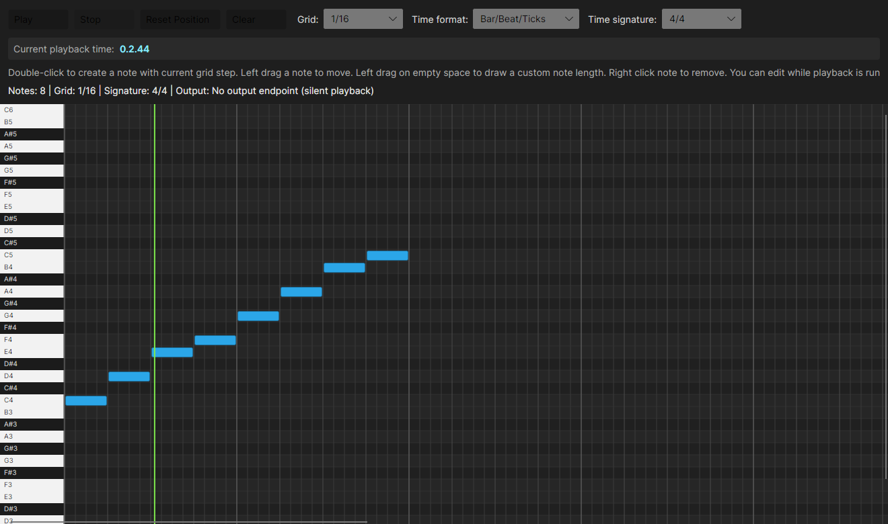

# Melanchall.PianoRollSequencerDemo

Avalonia demo app that shows a simple DAW-like piano roll powered by `Melanchall.DryWetMidi` `9.0.0-prerelease8`.

## Features

- Vertical playhead line moves during playback and remains at stop position.
- Play button toggles to stop while running (and back to play when stopped); space bar triggers the same toggle.
- Reset playback position button moves playhead to the start.
- Grid step can be changed (for example `1/4`, `1/8`, `1/16`, `1/32` in bar/beat formats).
- Displayed playback time format can be changed (`Metric`, `Musical`, `Bar/Beat/Ticks`, `Bar/Beat/Fraction`, `MIDI`).
- Grid step options follow selected time format (metric steps in milliseconds/seconds, musical steps in note lengths, bar/beat steps in note fractions).
- Time signature can be switched (`4/4`, `3/4`, `5/8`, `6/8`) for bar/beat-based time formats and grid updates accordingly.
- Current playback time is shown in a dedicated pane using selected format.
- Double-click on piano roll creates a note with current grid-step length.
- Left-side piano keys are displayed.
- Output endpoint can be selected from available MIDI outputs.
- Tool palette uses dedicated icon buttons for draw (`✏`) and cut (`✂`) tools.
- Tool-specific mouse cursors are used: brush for draw and knife for cut.
- Cut tool splits notes at the cursor position.
- Snapping can be toggled; cursor position is shown by a light vertical guide line that follows the mouse and snaps by grid steps when snapping is enabled.
- Double-clicking a note opens a velocity editor (`0`-`127`).
- Pressing `Enter` or clicking outside the editor applies the value and closes the editor.
- Default note velocity is `100`; note color brightness reflects velocity.
- Notes can be moved or removed, and edits are applied while playback is running through `ObservableTimedObjectsCollection` used by `Playback`.

## Run

```bash
dotnet run --project Utilities/PianoRollSequencerDemo/Melanchall.PianoRollSequencerDemo.csproj
```

## Screenshots

### Demo video (720p)

<video src="Screenshots/pianoroll-demo-lowrate.mp4" controls muted loop></video>

### Overview


### Editing during playback


