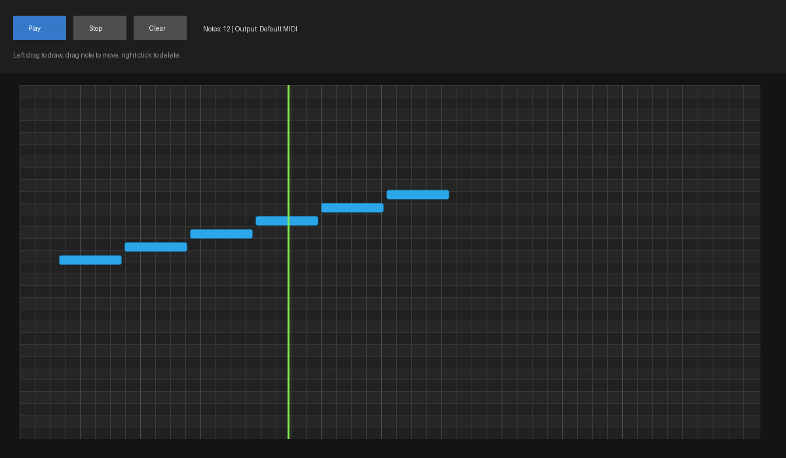

# Melanchall.PianoRollSequencerDemo

Avalonia demo app that shows a simple DAW-like piano roll powered by `Melanchall.DryWetMidi` `9.0.0-prerelease8`.

## Features

- Vertical playhead line moves during playback and remains at stop position.
- Reset playback position button moves playhead to the start.
- Grid step can be changed (`1/4`, `1/8`, `1/16`, `1/32`).
- Displayed playback time format can be changed (`Metric`, `Musical`, `Bar/Beat/Ticks`, `Bar/Beat/Fraction`, `MIDI`).
- Time signature can be switched (`4/4`, `3/4`, `5/8`, `6/8`) and grid updates accordingly.
- Current playback time is shown in a dedicated pane using selected format.
- Double-click on piano roll creates a note with current grid-step length.
- Left-side piano keys are displayed.
- Notes can be moved or removed, and edits are applied while playback is running through `ObservableTimedObjectsCollection` used by `Playback`.

## Run

```bash
dotnet run --project Utilities/PianoRollSequencerDemo/Melanchall.PianoRollSequencerDemo.csproj
```

## Screenshots

### Animated demo



### Low-rate video

<video src="Screenshots/pianoroll-demo-lowrate.mp4" controls muted loop></video>

### Overview


### Editing during playback


